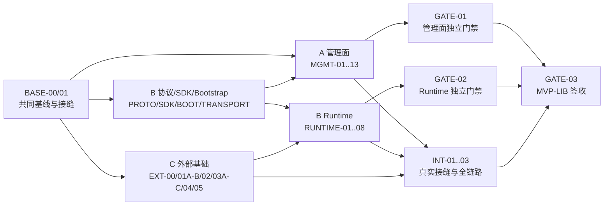

# Ora 插件管理库与 SDK MVP 实施计划

> 文档性质：实施任务与协作契约，不是协议规范。
> 规范真相源：[`design-v3.md`](./design-v3.md)。
> 状态真相源：GitHub Issue / PR；本文只保存稳定的任务 DAG、所有权和验收契约。

## 0. 文档元数据

| 项目 | 固定值 |
|---|---|
| 规范基线 | `design-v3.md` |
| 规范 SHA-256 | `4076F62DD45EDB427DF6DA6CDEB3EA12AADDF5A96084041EC60C4665EDCCAC0B` |
| 代码基线 | `86f30938e206d5e395a5d5f9aefb2ba8c7779a01` |
| 基线分支 | `feature/plugin-sp2-plugin-manager-2026-0714` |
| 目标平台 | Windows |
| 当前交付名称 | PluginManager Library + SDK MVP（下文简称 `MVP-LIB`） |
| 任务状态集合 | `Planned`, `Ready`, `InProgress`, `Blocked`, `InReview`, `Done`, `Deferred`, `Superseded` |

生成本文时，`docs/plugin-management/` 尚未进入 Git 跟踪。`BASE-00` 完成以前，不得从不同的本地未跟踪副本开始并行开发；否则任务引用的设计 hash、fixture 与文件所有权没有共同历史，无法可靠复核。

### 0.1 文档优先级

出现冲突时按以下顺序处理：

1. `design-v3.md` 的规范性定义与不变量；
2. 已批准且与新设计版本、contracts、fixtures 和测试同一变更生效的 ADR；
3. 本实施计划中的任务边界、依赖和所有权；
4. GitHub Issue / PR 中的动态进度与实现证据。

任务卡不能修改 wire、ABI、Manifest、状态恢复或安全语义。若实现证明规范存在缺口，相关任务立即转为 `Blocked`，提出 ADR 与 `design-v4.md` 变更；禁止在代码或任务描述中静默产生第二套规范。

### 0.2 状态语义

| 状态 | 含义 |
|---|---|
| `Planned` | 已定义，但硬依赖尚未全部完成 |
| `Ready` | 硬依赖完成、输入稳定、可以领取 |
| `InProgress` | 唯一负责人已开始实现；每人同时最多一个 |
| `Blocked` | 已有可复现阻断，Issue 中记录阻断证据与解除条件 |
| `InReview` | 实现和任务级验收完成，等待指定 reviewer |
| `Done` | 已合入共同集成分支，验收证据可追溯；仅本地通过不算完成 |
| `Deferred` | 明确不属于 `MVP-LIB`，不阻塞当前签收 |
| `Superseded` | 任务被拆分或替代；原 ID 永不复用，并指向新 ID |

任务大小采用：`S`（目标不超过 1 个开发日）、`M`（目标 1–3 个开发日）与 `Epic`（只作聚合门禁，不可直接领取）。估算超过 3 个开发日的父卡不得进入 `Ready`；必须先拆成 executable 子卡，新任务继承父卡的依赖和验收，父卡仅在全部子卡 `Done` 后聚合完成。

---

## 1. 目标、范围与完成定义

### 1.1 `MVP-LIB` 目标

在不接入 Ora Web/Tauri/UI 的前提下，交付一个可由 Rust 调用且可通过真实 Bun fixture 验证的插件管理库与作者 SDK：

- 惰性扫描、识别和诊断本地候选插件；
- 通过单次、会话绑定、digest-bound 的授权链安装候选；
- 验证 Manifest、路径、包布局、完整性和当前 runtime support；
- 安装默认 disabled，并支持 enable、disable、uninstall、remove-data 与重启恢复；
- 管理 catalog、effective enablement、registry、launch-grant reference 和 crash policy；
- 使用 Host-owned private bootstrap 启动合法 Agent 插件；
- 完成 initialize、activate、typed invoke/stream/cancel、deactivate、exit；
- 通过 Windows Job Object 保证 Host、Bun 与 Agent 后代的生命周期收敛；
- 提供仅含 `./agent` 与 `./types` 的公开作者 SDK；
- 识别、安装和展示 Workbench 插件，但执行时稳定返回 `UnsupportedKind`。

### 1.2 当前不在范围内

以下内容不属于 `MVP-LIB`，不得为了“顺手接通”扩大任一任务：

- `ora-contracts`、Web Server、Tauri composition、WebView token bootstrap、HTTP/CORS/Origin；
- 插件管理页面、商店体验、插件详情 UI 和最终用户对话页面；
- 任意真实 Claude Code、Codex、OpenCode 插件实现；
- Workbench executor、UI/config/IM contribution executor；
- marketplace、签名、publisher trust、在线更新或首次运行下载 Bun；
- OS 权限 sandbox、独立 manager daemon、remote/web running location；
- v1 Plugin→Host 业务 Request、Host API facade、Memento/globalState/workspaceState；
- 对 `number_add`、NDJSON、`getNums/returnNums` 或 `./host` 的兼容层。

完成 `MVP-LIB` 不等于完成 `design-v3.md` 定义的完整 Ora 应用 MVP。完整应用仍需要另行规划 `ora-contracts`、BackendRuntime、Tauri、认证 loopback API 与前端消费。

### 1.3 设计里程碑映射

| `design-v3` 里程碑 | `MVP-LIB` 处理方式 |
|---|---|
| M0 规范与门禁 | 纳入 Manifest/Frame/Agent contract、Golden、SDK/Runtime 测试门禁；Tauri resource 绑定后置 |
| M1 模型、扫描与状态 | 全部纳入 |
| M2 安装、卸载与恢复 | 全部纳入 |
| M3 进程树与 Frame codec | 全部纳入库、通用 process 与构建时 runtime asset；应用打包绑定后置 |
| M4 Runtime actor 与握手 | 全部纳入 |
| M5 Agent contract 与应用接入 | Agent contract、公开 SDK、private runtime 纳入；contracts/backend/Tauri/HTTP/UI 后置 |

### 1.4 最终门禁裁剪

`design-v3.md` §17.5 的条目 1–15、17–23 属于当前签收；其中：

- 条目 16 只纳入 SelectionHandle/CandidateHandle、source-changed digest binding 与 session/replay 语义的库级测试；loopback bearer、Host、Origin 和 WebView bootstrap 后置；
- 条目 18 的真实 Rust↔Bun E2E 纳入；
- 条目 22 的 Job Object、tree-empty 和安全删除纳入；Tauri 崩溃入口由等价的 Host-process fixture 验证；
- 条目 24 的 CORS preflight 全部后置。

因此 `GATE-03` 只能声明 `MVP-LIB` 完成，不能把完整 `design-v3` 或 Ora 应用 MVP 标为完成。

---

## 2. 人员、路径和集成所有权

| 角色 | 主责 | 独占代码范围 | 默认 reviewer |
|---|---|---|---|
| A：管理面负责人 | 扫描、验证、状态、安装、启禁、卸载、恢复、PluginManager facade | `crates/plugin-manager/src` 中 management/install/catalog/facade；`crates/plugin-manager/{Cargo.toml,src/lib.rs}` | B |
| B：Runtime/SDK 负责人 | 协议 DTO、Frame、Runtime actor、private bootstrap、公开 SDK | `crates/plugin-protocol/**`、`crates/plugin-manager/src/{transport,runtime}/**`、`packages/plugin-sdk/**`、`packages/plugin-runtime/**` | A |
| C：外部模块负责人 | Windows 进程树、测试生成工具、Bun 资产供给、根依赖与锁文件 | `crates/process/**`、`Taskfile.yml`、`xtask/**`、workspace manifests 与 lockfiles | B；根集成由 A 复核 |

本计划中的 C 是需求确认后从第一阶段参与的真实第三位同事，不是 A/B 的兼职标签。A、B 是两位主开发者；C 只承担为了让插件库可验证而必须修改的通用 process/构建边界，不扩展到 Web/Tauri/UI。

### 2.1 共享热点

以下文件不得由两个任务并行修改：

- `crates/plugin-manager/src/lib.rs`、`manager.rs`、`config.rs`、`error.rs` 与 crate manifest：A 接线；
- `crates/plugin-protocol/src/lib.rs`、protocol crate manifest、`xtask/src/export_plugin_sdk.rs` 的生成语义和生成的 SDK types：B 接线；
- 根 `Cargo.toml`/`Cargo.lock`、`pnpm-lock.yaml`、`Taskfile.yml`、xtask 的命令注册/check wiring：C 接线；
- Golden fixture：B 写入；A/C 只通过消费者测试引用；
- 完整测试生成结果和 lockfile：只在明确的集成窗口由对应 owner 生成并提交。

若任务需要修改非 owned path，负责人不得直接扩展权限：在 PR 中提交接线说明或最小补丁建议，由该路径 owner 在独立提交中应用。

### 2.2 分支、PR 与状态

- `BASE-00` 后，所有任务分支从同一基线创建；一个任务一个 branch/worktree/PR。
- PR 标题必须以任务 ID 开头，例如 `MGMT-03: implement manifest validation`。
- GitHub Issue 保存实时状态、阻断、测试日志和 PR/commit；本文不承担看板功能。
- 公共契约 PR 必须由消费方 reviewer 批准；单方自审不能将任务置为 `Done`。
- 每位负责人同一时间最多一个 `InProgress`；同一 wave 只代表“依赖允许并行”，不代表同一负责人并行编辑多个任务。
- 每个 PR 只实现一张任务卡。机械接线必须由卡中列出的 shared-file owner 完成，不得夹带无关重构。

---

## 3. 冻结接缝与真相源

`BASE-01` 只冻结接口与所有权，不实现完整业务。后续任务可使用 fake，但不能改变以下语义。

### 3.1 管理面到 Runtime

`RuntimeAdmissionProvider` 每次 start/invoke 都返回 fresh 的 `ValidatedLaunchDescriptor`。descriptor 至少冻结：

- `PluginId` 与当前安装 `ContentOwnerId`；
- 本次复验的 manifest/tree digest；
- Host 计算的受管 extension、entry、storage 路径；
- 精确 provider descriptors；
- `EnablementEpoch` 与 `RegistryRevision`；
- `PluginLaunchGrantRef`，只含引用和元数据，不含 secret value；
- 需要的 plugin API、Agent contract 与 runtime asset identity。

provider 必须在返回前复验 valid、compatible、supported、integrity、installed、effective-enabled；不得接受客户端 path、manifest、digest 或 launch value。Runtime 在进入 Running 前再次核对 epoch/revision，旧 descriptor fail closed。

### 3.2 Runtime 到管理面

`PluginRuntimeEventSink` 只接收带 `PluginId`、`ContentOwnerId`、`GenerationId` 和 monotonic actor sequence 的 typed lifecycle event：started、stopped、crashed、tree-reaped。Runtime 不计算 crash window，也不直接写持久状态；管理面是 CrashLoop 和用户 enablement 的唯一写者。

actor 持有内部状态或 writer/pending gate 时不得同步回调 sink。影响 admission/crash policy 的 lifecycle event 不得 drop/coalesce；队列不可用必须停止对应 generation 并关闭 admission。只有可重建的 observer telemetry 可以有界丢弃，且必须发出 sequence gap/dropped-count 诊断。

### 3.3 管理生命周期控制

`PluginRuntimeControl` 为 disable、uninstall、remove-data 和 shutdown 提供 typed stop/reap 能力。管理面先在状态 actor 中关闭 admission/推进 epoch，再调用 Runtime；返回成功表示该插件当前 generation 已停止且整棵进程树 tree-empty。失败时安装事实和用户意图按 `design-v3` 的 pending/recovery 规则保留，不能假装卸载完成。

A 使用 fake control 完成管理面排序测试；B 使用 fake admission/event sink 完成 Runtime 测试；只有 `INT-01` 接真实实现。

### 3.4 通用进程树

C 冻结并实现以下职责边界：

- `ProcessTreeSpawner` 接收 `ProcessSpec` 与启动策略；`SpawnTransaction` 创建 named-pipe endpoints，并只向成功启动的 `ManagedProcessTree` 移交所有权；
- `ManagedProcessTree` 只能拆分为 stdin/stdout/stderr、controller、direct-exit future、tree-empty future；
- `ProcessTreeController` 只负责幂等 `terminate_tree`；graceful deactivate/exit 是 Runtime 协议职责。controller 的存在不阻止 exit/tree-empty 被观察；
- Job Object 在插件代码执行前原子绑定，只有三个指定 child stdio handle 可继承；
- direct process exit 与 tree-empty 是不同事实；Drop/Host crash 必须终止整棵树。

### 3.5 协议与生成方向

| 事实 | 唯一真相源 | 消费者 |
|---|---|---|
| Manifest v1 / Workbench v1 | `ora-plugin-protocol` Rust types + `design-v3` §5 | manager validation、生成 TS types |
| Frame v1 / JSON-RPC / lifecycle | `design-v3` §12 + `crates/plugin-protocol/fixtures/v1/frame-golden.json` | Rust transport、private runtime |
| Agent Contract v1 | `ora-plugin-protocol` Rust types + §13 + `crates/plugin-protocol/fixtures/v1/agent-contract-golden.json` | public SDK、private runtime、manager runtime |
| runtime asset identity | Host-owned asset manifest/receipt | manager runtime、C 的构建任务 |
| public SDK ABI | `packages/plugin-sdk` `./agent`/`./types` exports | 插件作者与 pack fixture |

Frame Golden fixture 必须是机器可读的单一文件，至少保存 type、payload UTF-8 bytes、payload length、5-byte header 和完整 frame hex。Rust 与 TypeScript 测试只能读取该 fixture，不得各自复制常量。

---

## 4. 任务卡规则与 DAG

### 4.1 字段要求

每张任务卡包含：

- **Owner / Reviewer / Status / Size**；
- **Design refs**：只加载必要章节，不复制规范；
- **Owned paths / Shared paths**；
- **Hard dependencies**：未 `Done` 时任务不能进入 `Ready`；
- **Consumes frozen contract**：可通过 fake/fixture 并行，不是实现依赖；
- **Blocks**：直接下游任务；
- **Outcome / Implementation contract / Out of scope**；
- **Acceptance**：可执行命令、正反场景和不得发生的副作用；
- **Evidence / Handoff**：Issue、PR、commit、测试输出、导出类型和已知风险。

`Hard dependencies` 只表示实现或验收无法安全开始的事实依赖。若只需要稳定接口，应列入 `Consumes frozen contract`，避免把本可并行的工作错误串行化。

### 4.2 顶层 DAG



### 4.3 拓扑索引

下表按可启动顺序排列。每项的所有硬依赖都出现在自身之前；同 wave 中没有隐式完成顺序，单个负责人的执行优先级按任务 ID 与任务卡依赖决定。

| Wave | ID | Owner | 交付结果 | Hard dependencies |
|---:|---|---|---|---|
| 0 | BASE-00 | A | 将设计与实施计划纳入共同 Git 基线 | 无 |
| 0 | BASE-01 | A+B+C | 冻结接缝、fixture、所有权和评审规则 | BASE-00 |
| 1 | MGMT-01 | A | no-follow 文件系统审计与安全删除基础 | BASE-01 |
| 1 | PROTO-01 | B | identity、Manifest、Workbench、limits 基础 DTO | BASE-01 |
| 1 | EXT-00 | C | 根依赖、lockfile 与 shared-file request 基线 | BASE-01 |
| 1 | EXT-01A | C | 当前 SDK filter、递归测试与生成 drift 门禁 | BASE-01 |
| 1 | EXT-02 | C | ProcessTree 接口、fake 与环境策略 | BASE-01 |
| 1 | EXT-04 | C | pinned Bun 获取、缓存与摘要校验 | BASE-01 |
| 2 | MGMT-02 | A | tree digest、receipt、content owner | MGMT-01, PROTO-01 |
| 2 | MGMT-03 | A | identity/manifest/path/compat/support/integrity 验证 | MGMT-01, PROTO-01 |
| 2 | MGMT-04 | A | ManagerLease、gates、state actor 与普通提交 | MGMT-01, MGMT-02, PROTO-01 |
| 2 | PROTO-02 | B | Frame/JSON-RPC/lifecycle DTO 与 Golden | PROTO-01 |
| 2 | PROTO-03 | B | Agent Contract DTO、leaf types 与 method registry | PROTO-01 |
| 2 | SDK-01 | B | 删除旧 API，建立 public package/test 基础 | PROTO-01, EXT-01A |
| 2 | EXT-03A | C | SpawnTransaction、Job 与原子启动 | EXT-00, EXT-02 |
| 2 | EXT-03B | C | named pipes、HANDLE_LIST 与 RAII 移交 | EXT-03A |
| 2 | EXT-03C | C | controller/direct-exit/tree-empty 与 Windows helper E2E | EXT-03B |
| 3 | MGMT-05 | A | 状态 backup recovery 与 fail-closed | MGMT-01, MGMT-04 |
| 3 | MGMT-06 | A | inert discovery 与 SelectionHandle authority | MGMT-03 |
| 3 | MGMT-08 | A | installed scan、catalog、enablement、registry | MGMT-02, MGMT-03, MGMT-04 |
| 3 | TRANSPORT-01 | B | Rust 5-byte Frame codec | PROTO-02 |
| 3 | SDK-02 | B | public Agent ABI 与 structural contract | PROTO-03, SDK-01 |
| 3 | BOOT-01 | B | private runtime package 与 TS transport | PROTO-02, SDK-01, EXT-04 |
| 3 | EXT-01B | C | 将 private runtime 接入根测试并证明非零发现 | EXT-01A, BOOT-01 |
| 3 | PORT-01 | A | 编译级 management↔runtime ports 与 fakes | MGMT-02, MGMT-04, PROTO-02 |
| 4 | MGMT-07 | A | identify、CandidateHandle 与 source binding | MGMT-02, MGMT-06 |
| 4 | SDK-03 | B | materialized pack/validate | SDK-02, EXT-04 |
| 4 | BOOT-02 | B | initialize/activate/deactivate/exit | BOOT-01, SDK-02 |
| 4 | RUNTIME-01 | B | Runtime actor/supervisor 骨架 | EXT-02, PROTO-02, PROTO-03, TRANSPORT-01, PORT-01 |
| 5 | MGMT-09 | A | 安装流水线 | MGMT-05, MGMT-07, MGMT-08 |
| 5 | MGMT-10 | A | enable/disable 与 epoch admission | MGMT-08, PORT-01 |
| 5 | MGMT-11 | A | uninstall、trash 与 remove-data | MGMT-01, MGMT-05, MGMT-09, MGMT-10 |
| 5 | BOOT-03 | B | ordinary/safety executor、stream 与 cancel | BOOT-02, PROTO-03 |
| 5 | RUNTIME-02 | B | pending/write-ack/fatal 因果内核 | RUNTIME-01 |
| 5 | RUNTIME-07 | B | runtime asset schema/store/deploy/recovery | PROTO-02, EXT-04 |
| 6 | MGMT-12 | A | startup reconcile 与 fault injection | MGMT-05, MGMT-09, MGMT-11 |
| 6 | MGMT-13 | A | PluginManagement facade、grant、crash policy | MGMT-10, MGMT-12, PORT-01 |
| 6 | RUNTIME-03 | B | spawn、handshake、I/O watchers 与 Draining | RUNTIME-02 |
| 6 | RUNTIME-04 | B | invocation stream 与 backpressure | PROTO-03, RUNTIME-03 |
| 6 | RUNTIME-05 | B | cancel/deadline/UnknownOutcome | RUNTIME-04 |
| 6 | RUNTIME-06 | B | stop/drain/tree-reap/crash | EXT-02, RUNTIME-05, PORT-01 |
| 6 | RUNTIME-08 | B | AgentPluginRuntime facade 与 fake E2E | RUNTIME-06, RUNTIME-07 |
| 6 | EXT-05 | C | private runtime/Bun 构建与完整测试接线 | EXT-01B, EXT-04, BOOT-03, RUNTIME-07 |
| 6 | OBS-01 | A | lifecycle/observer 事件、日志字段与 redaction 门禁 | MGMT-13, RUNTIME-08 |
| 7 | GATE-01 | A | 管理面无 spawn 独立 E2E | MGMT-13 |
| 7 | GATE-02 | B | fake admission + 真实 Bun/Job 独立 E2E | RUNTIME-08, EXT-03C, EXT-05, SDK-03 |
| 7 | INT-01 | A | 接通 admission、control 与 runtime events | MGMT-10, MGMT-13, RUNTIME-08 |
| 7 | INT-02 | B | 接入真实 ProcessTree、assets 与 packed fixture | INT-01, EXT-03C, EXT-05, BOOT-03, SDK-03 |
| 7 | INT-03 | A | 完整库级管理与调用流程 | MGMT-09, MGMT-12, INT-02 |
| 7 | GATE-03 | A | 全量门禁、证据索引与剩余项清单 | GATE-01, GATE-02, INT-03, OBS-01 |

### 4.4 Epic 的强制 executable 切片

Epic 只聚合设计与下游依赖，不对应代码 PR。下列子卡必须分别创建 Issue/branch/PR；§10 为每张子卡提供完整、可直接领取的字段，Issue 只同步动态状态和证据，不重新做任务设计。父卡只有在全部子卡合入且父级验收通过后才为 `Done`。

| Parent | Executable child | 独立交付 | 直接依赖 |
|---|---|---|---|
| MGMT-01 | MGMT-01A | no-follow 枚举、对象 identity、ADS/reparse/hardlink/case/depth 审计 | BASE-01 |
| MGMT-01 | MGMT-01B | handle-pinned SafeTreeDeleter、delete-time swap 与外部 sentinel tests | MGMT-01A |
| MGMT-01 | MGMT-01C | fresh-file 受控复制、source identity 复核与 destination no-link 保证 | MGMT-01A |
| MGMT-04 | MGMT-04A | ManagerLease、per-plugin gate 与 package mutation coordinator | BASE-01, PROTO-01 |
| MGMT-04 | MGMT-04B | state model、revision/epoch 与单写者 actor | MGMT-02, MGMT-04A |
| MGMT-04 | MGMT-04C | temp/flush/replace、previous snapshot 与 PersistenceUncertain | MGMT-04B |
| MGMT-05 | MGMT-05A | primary/backup 解析、恢复 decision matrix 与 fail-closed state | MGMT-04C |
| MGMT-05 | MGMT-05B | handle quarantine、clean-primary commit、kill/restart 与 stale grant tests | MGMT-01B, MGMT-05A |
| MGMT-09 | MGMT-09A | Candidate consume、fresh-file staging、复验与 digest equality | MGMT-01C, MGMT-05, MGMT-07, MGMT-08 |
| MGMT-09 | MGMT-09B | receipt、PendingInstall、final rename、state commit 与 crash points | MGMT-09A |
| MGMT-11 | MGMT-11A | stop→tombstone→trash→remove-record removal journal | MGMT-05, MGMT-10 |
| MGMT-11 | MGMT-11B | remove-data scopes、SafeTreeDeleter、occupied trash cleanup | MGMT-01B, MGMT-11A |
| MGMT-12 | MGMT-12A | install pending/untracked final startup reconciliation | MGMT-05, MGMT-09 |
| MGMT-12 | MGMT-12B | removal/trash/tombstone reconciliation 与幂等收敛 | MGMT-11, MGMT-12A |
| MGMT-12 | MGMT-12C | 可注入 fault harness、全阶段 restart matrix 与证据汇总 | MGMT-12B |
| MGMT-13 | MGMT-13A | PluginManagement facade、launch grant reference/resolver use cases | MGMT-10, MGMT-12, PORT-01 |
| MGMT-13 | MGMT-13B | critical lifecycle events、observer events、crash window/CrashLoop/reset | MGMT-13A |
| PROTO-02 | PROTO-02A | Frame/lifecycle DTO、initialize limits 与 canonical Golden | PROTO-01 |
| PROTO-02 | PROTO-02B | strict JSON-RPC/profile/type-envelope matrix | PROTO-02A |
| PROTO-03 | PROTO-03A | leaf newtypes、JsonValue/JsonSafeU64、AgentScope/configuration | PROTO-01 |
| PROTO-03 | PROTO-03B | request/result/event/error 判别联合 | PROTO-03A |
| PROTO-03 | PROTO-03C | method registry、metadata 与 Rust↔TS Golden | PROTO-03B |
| SDK-03 | SDK-03A | pinned Bun materialized pack 到输入树外 staging | SDK-02, EXT-04 |
| SDK-03 | SDK-03B | parser/metafile/allowlist/link/native/relocation security validator | SDK-03A |
| BOOT-03 | BOOT-03A | ordinary dispatch、AsyncGenerator 与 stream/terminal barrier | BOOT-02, PROTO-03 |
| BOOT-03 | BOOT-03B | per-call transport cancel、AbortSignal 与 handler settlement | BOOT-03A |
| BOOT-03 | BOOT-03C | business safety cancel、active-turn 与 safety reserve/fatal fallback | BOOT-03B |
| RUNTIME-01 | RUNTIME-01A | actor state/mailbox/supervisor/generation foundations | PORT-01, PROTO-02, PROTO-03, TRANSPORT-01 |
| RUNTIME-01 | RUNTIME-01B | single-flight、CancellingStart、late spawn 与 CleanupPending | RUNTIME-01A, EXT-02 |
| RUNTIME-02 | RUNTIME-02A | pending ids/tombstones、writer ack 与 bytes classification | RUNTIME-01 |
| RUNTIME-02 | RUNTIME-02B | deferred inbound、primary trigger/cause 与 owner settlement | RUNTIME-02A |
| RUNTIME-02 | RUNTIME-02C | fatal stage matrix 与 deterministic reverse-order tests | RUNTIME-02B |
| RUNTIME-03 | RUNTIME-03A | spawn/env/grant、initialize/activate、post-activate recheck | RUNTIME-02 |
| RUNTIME-03 | RUNTIME-03B | reader/stderr/exit/tree/EOF watchers 与 Draining | RUNTIME-03A |
| RUNTIME-05 | RUNTIME-05A | intent ordering、clocks/caps 与 transport cancel write | RUNTIME-04 |
| RUNTIME-05 | RUNTIME-05B | write-state×idempotency×fatal/terminal outcome matrix | RUNTIME-05A |
| RUNTIME-05 | RUNTIME-05C | business safety、deadline reverse-order 与 tombstone cleanup | RUNTIME-05B |
| RUNTIME-06 | RUNTIME-06A | deactivate/exit、Stopping 与 graceful/tree grace | RUNTIME-05, PORT-01 |
| RUNTIME-06 | RUNTIME-06B | force terminate、CleanupPending、tree-empty/reap | RUNTIME-06A, EXT-02 |
| RUNTIME-06 | RUNTIME-06C | unexpected exit/EOF/protocol failure 与 typed lifecycle events | RUNTIME-06B |
| RUNTIME-07 | RUNTIME-07A | asset manifest/receipt/layout、source trait 与 validation | PROTO-02, EXT-04 |
| RUNTIME-07 | RUNTIME-07B | staging deploy、active lease、spawn-time verify 与 recovery | RUNTIME-07A |

---

## 5. 任务卡

任务卡中的 `Evidence` 初始为 `Pending`。任务进入 `InReview` 前，负责人必须把证据写入对应 GitHub Issue/PR，而不是频繁修改本文。

### BASE-00 — 建立共同可引用基线

- **Owner / Reviewer / Status / Size**：A / B+C / `Ready` / S
- **Design refs**：§1、§22.5
- **Owned paths**：`docs/plugin-management/design-v3.md`、本文
- **Shared paths**：无代码路径
- **Hard dependencies**：无
- **Consumes frozen contract**：最终审核通过的 `design-v3.md` hash
- **Blocks**：BASE-01 以及全部实现任务

**Outcome**

最终设计与本文进入同一个可引用的 Git commit；三位开发者从该 commit 创建任务分支，不再依赖本地未跟踪副本。

**Implementation contract**

- 不修改 `design-v3.md` 内容、编码、换行或 hash；
- 只 stage `docs/plugin-management/design-v3.md` 与 `docs/plugin-management/implementation-plan.md`；禁止 `git add docs/plugin-management`、`git add .` 或清理其他用户未跟踪文件；
- 提交前记录完整 64 位设计 hash、Ora HEAD、分支与 `git status --short`；
- 明确 `packages/plugin-sdk/src/types/plugin-manifest.ts` 是当前未跟踪且与 v3 不兼容的旧草稿，后续由 SDK-01 删除/替换，不得误纳为已实现基线；
- 本任务只建立文档基线，不开始任何协议或代码实现。

**Out of scope**

创建实现分支、改代码、创建大而全的实现 PR、把 `design.md`/`design-v2.md` 当作当前规范。

**Acceptance**

- `Get-FileHash -Algorithm SHA256 docs/plugin-management/design-v3.md` 精确等于本文记录值；
- `git ls-files docs/plugin-management/design-v3.md docs/plugin-management/implementation-plan.md` 返回两个文件；
- 基线提交后 `git show <commit>:docs/plugin-management/design-v3.md` 的 hash 相同；
- Issue/PR 中附基线 commit id 与干净范围说明。

**Evidence / Handoff**：Pending。交接物是共同基线 commit 与三位开发者确认记录。

### BASE-01 — 冻结接缝、fixture 与评审契约

- **DRI / Contributors / Reviewer / Status / Size**：A / B+C / B+C / `Planned` / S
- **Design refs**：§3、§4.2–4.3、§7、§11–13、§15.1、§16
- **Owned paths**：本文 §2–§4；A 预接 manager private module shells，B/C 固定各自 fixture/trait contract artifact
- **Shared paths**：所有后续公共接缝
- **Hard dependencies**：BASE-00
- **Consumes frozen contract**：`design-v3.md`
- **Blocks**：全部 Wave 1–7 任务

**Outcome**

三方对管理↔Runtime、Runtime↔process、Rust↔TypeScript 的职责、所有权、错误边界、fake 策略和 fixture 位置书面签字，后续任务不再临时改变接缝。

**Implementation contract**

- 冻结 §3 中五个接缝与单向数据流，提交 exact signature/schema artifact；最终 Rust ports 与 deterministic fakes 由 PORT-01 在 MGMT-02/04 类型可用后实现；
- fixture 采用单一 machine-readable truth source，Rust/TS 都是消费者；
- 固定 fixture 路径为 `crates/plugin-protocol/fixtures/v1/{frame-golden,agent-contract-golden}.json`，固定 private package 名/路径、runtime asset manifest schema/path 与唯一 Windows target `x86_64-pc-windows-msvc`；
- pinned Bun 的 exact version、官方 artifact URL 与 SHA-256 必须经 A/B/C 人工批准后落盘；未批准前 EXT-04 保持 `Blocked`，AI Agent 不得自行选择 `latest`；
- 预接 `transport`/`runtime` 私有 module shell，使 B 无需编辑 A 独占的 `lib.rs`；
- 明确 `Hard dependencies` 与 `Consumes frozen contract` 的差异；
- 冻结共享文件 owner 与 cross-reviewer；
- 不用空 interface 预占未来 Plugin→Host API，也不添加兼容 shim；
- 若签字时发现设计冲突，BASE-01 保持未完成并走 ADR/design-v4，不在 kickoff 中口头覆盖。

**Out of scope**

实现业务逻辑、选择具体锁实现、调优队列大小、修改设计常量。

**Acceptance**

- A/B/C 分别确认独立 fake 策略，manager 的预接私有 module shells 在同一 baseline 上编译；
- 所有公共类型都有唯一 owner 和 reviewer；
- DAG 静态检查无环，所有依赖 ID 存在；
- 后续每张任务卡都能追溯到本接缝或具体设计章节。

**Evidence / Handoff**：Pending。交接物是批准记录、fixture 路径与接缝签名索引。

### MGMT-01 — Windows 安全文件系统基础

- **Owner / Reviewer / Status / Size**：A / B / `Planned` / Epic
- **Design refs**：§3、§5.2、§8、§14.2、§17.1、§17.3
- **Owned paths**：`crates/plugin-manager/src/install/safe_fs.rs` 及同模块测试
- **Shared paths**：`crates/plugin-manager/src/lib.rs` 由 A 在任务末接线
- **Hard dependencies**：BASE-01
- **Consumes frozen contract**：`PluginLimits` 数值与 `PluginRelativePath` 语义
- **Blocks**：MGMT-02、MGMT-03、MGMT-05、MGMT-11

**Outcome**

提供 handle-oriented、no-follow、fail-closed 的树审计、受控复制和安全删除原语，后续 scanner/installer/reconciler 不再自行拼接或递归操作路径。

**Implementation contract**

- 使用 `Path`/`PathBuf`，不硬编码分隔符；
- 拒绝 absolute/UNC/盘符/`..`/设备名/尾随点空格/ADS 语法；
- 枚举并拒绝 reparse point、named stream、link count≠1、case collision、深度/文件数/字节预算超限；
- canonical path 只能作为诊断，安全决策基于 pinned handle identity 与父子关系；
- 删除在 child handle 固定后执行 disposition，路径 swap 或不支持的卷能力必须 fail closed；
- trait 有 doc comment，纯规则拆成可独立测试函数，测试不修改进程环境。

**Out of scope**

Manifest 语义、安装事务、状态提交、把 reparse target 跟随复制进受管目录。

**Acceptance**

- 覆盖 §17.1/§17.3 的路径、ADS、reparse、hardlink、case collision、depth 64/65 与 delete-time swap；
- 外部 sentinel 在所有攻击 fixture 下保持不变；
- 测试使用 `pretty_assertions::assert_eq` 比较完整审计结果；
- `cargo test -p ora-plugin-manager safe_fs` 通过。

**Evidence / Handoff**：Pending。交接物是审计/复制/删除 API、错误分类和可复用 fixture builders。

### MGMT-02 — Tree digest、receipt 与 content owner

- **Owner / Reviewer / Status / Size**：A / B / `Planned` / M
- **Design refs**：§6.1–6.3、§8.3、§9、§14.2、§17.1
- **Owned paths**：`crates/plugin-manager/src/install/{digest,receipt}.rs`
- **Shared paths**：protocol identity types 只读消费
- **Hard dependencies**：MGMT-01、PROTO-01
- **Consumes frozen contract**：`PluginId`、严格 SemVer、receipt schema、规范 tree-digest 编码
- **Blocks**：MGMT-07、MGMT-08、MGMT-09

**Outcome**

同一无链接 materialized tree 在不同扫描顺序和运行间生成稳定 digest；Host-owned receipt 精确描述安装事实而不修改作者 Manifest。

**Implementation contract**

- digest 包含规范相对路径、entry kind、长度与 bytes，并按规范 byte ordering 排序；
- 不读取或跟随 link/reparse；文件 identity 在读取前后变化视为 source changed；
- receipt 包含 id/version/content owner/tree digest/manifest digest/source audit/runtime facts，不含 enablement、secret value 或作者字段副本；
- receipt 采用 strict schema、版本字段和有界读取；
- 安装 owner 在卸载/重装后变化，旧 grant/storage/conversation 不得跨 owner 继承。

**Out of scope**

签名、publisher trust、把 install timestamp 写回 `package.json`。

**Acceptance**

- 路径顺序、Unicode、空文件、边界长度和内容变化 fixture 产生预期完整对象；
- 同内容重复运行 digest 相同，任一 byte/path/kind 改变 digest 不同；
- link/reparse/hardlink 被拒绝而非摘要；
- receipt round-trip、未知字段/版本、超限和篡改测试通过。

**Evidence / Handoff**：Pending。交接物是 digest/receipt API、fixture digest 值和 owner 语义说明。

### MGMT-03 — Manifest、身份与支持矩阵验证

- **Owner / Reviewer / Status / Size**：A / B / `Planned` / M
- **Design refs**：§5、§8、§13.2、§14.2、§17.1
- **Owned paths**：`crates/plugin-manager/src/{identity,manifest,validation}.rs`
- **Shared paths**：PROTO-01 types；A 接线 facade exports
- **Hard dependencies**：MGMT-01、PROTO-01
- **Consumes frozen contract**：Manifest v1/Workbench v1、`PluginLimits`、Ora/pluginApi/Bun 版本轴
- **Blocks**：MGMT-06、MGMT-08

**Outcome**

把 `ManifestValidity`、`RuntimeCompatibility`、`RuntimeSupport`、`IntegrityStatus` 建模为正交结果；合法 Workbench 保持可管理但不可执行。

**Implementation contract**

- 有界读取 minimal envelope 后再按 manifestVersion/kind 路由严格 schema；
- known v1 未知字段是 invalid，unknown manifestVersion 是可诊断 unsupported schema，不能按 v1 误报；
- 实现 PluginId/provider id、SemVer/engine、entry containment、contribution uniqueness 和 package allowlist；
- Agent v1 要求单 ESM materialized entry、精确 pluginApi=1、合法 Bun range；
- Workbench v1 禁止 main/dynamic capability，support 为 unsupported 而 validity 为 valid；
- 验证无副作用，不执行脚本、`bun install`、import 或候选代码。

**Out of scope**

扫描根授权、复制、enablement、Runtime spawn。

**Acceptance**

- strict/duplicate-key/depth 64/65、id/provider、engine、kind、entry、bundle layout 全边界通过；
- Agent 与 Workbench 完整结果对象 deep-equal；
- invalid/incompatible/unsupported/integrity mismatch 分类不互相覆盖；
- 验证 fixture 证明候选目录 mtime/content 未变化且零进程启动。

**Evidence / Handoff**：Pending。交接物是验证 API、诊断码矩阵和合法 Agent/Workbench fixtures。

### MGMT-04 — ManagerLease、状态 actor 与普通提交

- **Owner / Reviewer / Status / Size**：A / B / `Planned` / Epic
- **Design refs**：§6.4、§7、§9、§10、§11.1、§15.1、§17.2
- **Owned paths**：`crates/plugin-manager/src/{package_store,state,enablement,registry}.rs` 的基础部分
- **Shared paths**：PluginManager composition 由 A 后续接线
- **Hard dependencies**：MGMT-01、MGMT-02、PROTO-01
- **Consumes frozen contract**：state schema、revision/epoch、pending operation、launch-grant/crash-policy 记录形态
- **Blocks**：MGMT-05、MGMT-08

**Outcome**

同一 data dir 只有一个进程生命周期写者；所有状态 mutation 经单 actor 与 per-plugin gate 串行化，普通提交拥有可判定的成功/失败/不确定结果。

**Implementation contract**

- ManagerLease 在 readiness 前获取并持有到 shutdown；竞争写者稳定失败；
- 状态使用带关联数据的 enum 表达 pending install/removal/recovery，避免 optional-field 非法组合；
- revision、enablement epoch 单调，写入先形成新完整状态再原子替换；
- Replace/rename 结果不确定进入 `PersistenceUncertain`，不得继续 mutation 或 readiness；
- state 不含 secret value、resolved executable/path 或 runtime child handle；
- actor 锁内不调用 Runtime/event sink；tracing 测试全部在 test-scoped TRACE 下执行。

**Out of scope**

损坏 primary 恢复、完整安装算法、Runtime actor。

**Acceptance**

- 两个 manager 对同 data dir 只有一个成功 lease；
- 并发 mutation 按 actor sequence 得到稳定 revision；
- temp/write/flush/replace 各失败点返回精确状态；
- process environment 不在测试中修改；完整 state 对象 deep-equal。

**Evidence / Handoff**：Pending。交接物是 lease guard、state actor port、commit result 与 fake store。

### MGMT-05 — 状态恢复与 fail-closed

- **Owner / Reviewer / Status / Size**：A / B / `Planned` / Epic
- **Design refs**：§6.4、§9.3、§14.2、§17.2、§17.5(23)
- **Owned paths**：`crates/plugin-manager/src/install/reconcile.rs` 的 state recovery 部分及 state tests
- **Shared paths**：MGMT-04 state actor
- **Hard dependencies**：MGMT-01、MGMT-04
- **Consumes frozen contract**：primary/previous 版本、quarantine、RecoveryRequired、PersistenceUncertain
- **Blocks**：MGMT-09、MGMT-11、MGMT-12

**Outcome**

primary 损坏时只从明确有效且兼容的 previous 恢复；恢复后的所有插件强制 disabled、launch grants 清空，未知事实永不靠扫描 final 猜测。

**Implementation contract**

- valid primary 优先；invalid primary + valid compatible backup 才自动恢复；
- invalid primary 先通过 handle-rename 隔离，再 no-replace 创建 clean primary，避免 `ReplaceFileW` 继承 ADS/metadata；
- primary/backup 双损坏、未来 schema、commit 不确定全部进入 RecoveryRequired/PersistenceUncertain；
- 恢复的新 primary 持久完成后才能 readiness；
- revision N grant → N+1 revoke → backup N 恢复时 grant 仍不得复活。

**Out of scope**

从 receipt/final 推断用户 enablement、自动删除无法解释的文件、应用 UI repair。

**Acceptance**

- 覆盖 §17.2 三类恢复、ADS/reparse/hardlink primary 和隔离后 kill；
- 恢复幂等，第二次启动不重复迁移或恢复 stale grant；
- 双损坏时 registry/runtime 为空且 manager 不开放 mutation；
- 状态日志不包含 grant value 或本地 secret。

**Evidence / Handoff**：Pending。交接物是 recovery decision matrix、故障注入 hooks 与 operator diagnostics。

### MGMT-06 — Candidate discovery 与 SelectionHandle authority

- **Owner / Reviewer / Status / Size**：A / B / `Planned` / M
- **Design refs**：§8.1–8.2、§14.3、§15.1、§17.2
- **Owned paths**：`crates/plugin-manager/src/{discovery,candidate_authority}.rs` 的 selection 部分
- **Shared paths**：无公开 path DTO
- **Hard dependencies**：MGMT-03
- **Consumes frozen contract**：DiscoveryRootId、SelectionHandle、management session、TTL/consume 语义
- **Blocks**：MGMT-07

**Outcome**

扫描配置根只返回 inert、安全展示的候选与 opaque SelectionHandle；调用者不能用路径、id 或 digest 构造安装授权。

**Implementation contract**

- 扫描根由 Host 配置并以 root identity 固定；native-picker 入口与普通 discovery 使用同一 authority 语义；
- handle 使用 CSPRNG bearer，绑定 session、canonical source、root identity、audit id、purpose、TTL 与单次 identify；
- scan 不深度解析全部代码、不执行、不写入、不产生 CandidateHandle；
- consume 原子化；过期、跨 session、重放、root replacement 返回稳定结构化错误；
- 对外结果不泄露可重新提交的本地 path 授权。

**Out of scope**

HTTP bearer/native picker UI、安装、Runtime admission。

**Acceptance**

- 正常根、case collision、越根、reparse root、替换 root identity 全覆盖；
- handle 过期/跨 session/重放只成功一次；
- scan 前后候选树 digest/mtime/进程列表无副作用差异；
- fake CSPRNG/clock 注入，不依赖全局环境。

**Evidence / Handoff**：Pending。交接物是 scanner/authority port、SelectionHandle failure enum 和 audit fields。

### MGMT-07 — Identify、CandidateHandle 与 source binding

- **Owner / Reviewer / Status / Size**：A / B / `Planned` / M
- **Design refs**：§8.2–8.3、§9.1、§14.3、§15.1、§17.2
- **Owned paths**：`crates/plugin-manager/src/candidate_authority.rs` 的 identify/candidate 部分
- **Shared paths**：MGMT-02 digest、MGMT-03 validator
- **Hard dependencies**：MGMT-02、MGMT-06
- **Consumes frozen contract**：CandidateHandle、reviewed identity/digest/risk summary
- **Blocks**：MGMT-09

**Outcome**

消费 SelectionHandle 后产生完整可审阅事实和一次性 CandidateHandle；安装只能消费该 handle，并在 staging 上证明事实未变化。

**Implementation contract**

- identify 原子消费 selection，重新固定 source/root identity，执行有界完整验证与 digest；
- CandidateHandle 绑定 session、expected id/version/tree digest、candidate audit id、TTL、purpose 与一次 install；
- install 尝试开始前即消费 candidate，任何失败都不能复用；
- 源文件 identity 在读取中变化、identify 后修改/替换、跨 session/过期/重放均为稳定错误；
- 展示 path 只能是不可用作授权的安全 display，不反向解析。

**Out of scope**

复制到 staging、最终安装提交、HTTP request shape。

**Acceptance**

- §17.2 授权链所有正反场景通过；
- reviewed digest 与 identity 使用完整对象断言；
- source changed 不产生任何 installed/staging bytes；
- 每个失败路径的 handle consumed 状态可观察且不可重试。

**Evidence / Handoff**：Pending。交接物是 IdentifiedPlugin/CandidateHandle API、failure matrix 和 source-change fixtures。

### MGMT-08 — Installed scan、Catalog、Enablement 与 Registry

- **Owner / Reviewer / Status / Size**：A / B / `Planned` / M
- **Design refs**：§5.5、§6、§7、§8.3、§10、§17.1、§17.5(5–6,17)
- **Owned paths**：`crates/plugin-manager/src/{catalog,enablement,registry,package_store}.rs`
- **Shared paths**：Runtime 只消费 immutable snapshot/descriptor
- **Hard dependencies**：MGMT-02、MGMT-03、MGMT-04
- **Consumes frozen contract**：InstalledPlugin、effective enablement、RegistryRevision/EnablementEpoch
- **Blocks**：MGMT-09、MGMT-10、INT-01

**Outcome**

把磁盘事实、用户 enablement 意图、派生 effective state、registry contribution 与 runtime generation 明确分层；catalog 保留 invalid/unsupported 诊断，registry 只含可运行贡献。

**Implementation contract**

- installed scan 只信受管布局、receipt、state 和重新验证结果；无 matching state/pending intent 的 final 为 untracked，不能自动收养；
- effective enablement 综合用户意图、validity、compatibility、support、integrity、missing files、pending removal 和 CrashLoop；
- registry 使用 immutable snapshot、单调 revision 与 delta；Workbench 不进入 Agent runtime registry；
- runtime descriptor 带 epoch/revision/content owner，旧 snapshot 在 admission 时被拒绝；
- invalid 安装仍在 catalog 中可诊断，但无 spawn 能力。

**Out of scope**

Runtime 启动、安装 mutation、前端列表 DTO。

**Acceptance**

- installed/invalid/incompatible/unsupported/corrupt/missing/pending-removal 的完整 catalog snapshot deep-equal；
- 用户 enabled 但 effective disabled 的原因稳定且不修改用户意图；
- registry delta/revision、provider duplicate、Workbench no-registration 和 stale epoch 全覆盖；
- scan 全程零 spawn、零安装目录 mutation。

**Evidence / Handoff**：Pending。交接物是 catalog snapshot、enablement evaluator、registry API 和 fake admission provider。

### PORT-01 — 编译级 Management↔Runtime Ports 与 Fakes

- **Owner / Reviewer / Status / Size**：A / B / `Planned` / M
- **Design refs**：§7.3、§10、§11.1–11.2、§14.3、§15.1、§16.2
- **Owned paths**：`crates/plugin-manager/src/runtime_ports.rs` 及 test fakes；`src/lib.rs` 由 A 接线但 ports 保持 crate-private
- **Shared paths**：B 的 `runtime/**` 只实现/消费本任务导出的 crate-private contracts
- **Hard dependencies**：MGMT-02、MGMT-04、PROTO-02
- **Consumes frozen contract**：BASE-01 signatures、PluginId/ContentOwnerId、lifecycle DTO
- **Blocks**：MGMT-10、MGMT-13、RUNTIME-01、RUNTIME-06、INT-01

**Outcome**

把 §3 的 prose 接缝落成可编译、可 fake、无循环依赖的静态 dispatch ports，使 A/B 分支可在不等待真实对方实现时独立编译和测试。

**Implementation contract**

- `ValidatedLaunchDescriptor` 字段精确覆盖 plugin/content owner、managed extension/entry/storage path、manifest/tree digest、provider descriptors、enablement epoch、registry revision、grant reference、pluginApi/contract/runtime asset identity；字段不可由客户端构造；
- `RuntimeAdmissionProvider` 返回 fresh descriptor，支持 activate 后的 epoch/revision recheck；失败使用结构化 PluginError；
- `PluginRuntimeControl` 提供幂等 stop/reap 语义；成功返回前 tree-empty，重复 stop 稳定成功；
- `PluginRuntimeEventSink` 只接 started/stopped/crashed/tree-reaped，critical delivery failure 语义固定；
- `LaunchValueResolver` 只在 spawn 边界解析 reference，返回的值使用最短生命周期且没有 Debug/Serialize；
- generation、epoch、revision、stop reason 和 event 使用 newtype/enum，使旧 owner/generation 无法误路由；
- 所有 trait 有角色/实现约束 doc comments，优先泛型静态 dispatch。

**Out of scope**

真实 Runtime actor、状态持久化实现、secret backend、公开 HTTP DTO。

**Acceptance**

- A 的 fake RuntimeControl 证明 disable/uninstall ordering；B 的 fake admission/sink 证明 start/crash ordering；
- stale epoch/revision、wrong content owner/generation、resolver failure 和 critical event backpressure 全部有稳定结果；
- compile-fail/API surface test 证明 paths/grant values 不进入可序列化 public facade；
- `cargo test -p ora-plugin-manager runtime_ports` 通过。

**Evidence / Handoff**：Pending。交接物是 exact symbols、fake implementations、sequence traces 与 B 可直接消费的 compile example。

### MGMT-09 — 授权安装流水线

- **Owner / Reviewer / Status / Size**：A / B / `Planned` / Epic
- **Design refs**：§6、§8.2、§9.1–9.2、§14.2、§17.2
- **Owned paths**：`crates/plugin-manager/src/install/mod.rs`、`package_store.rs` 的 install use case
- **Shared paths**：A 使用固定、人工构造且已审计的 materialized artifact fixture；SDK pack→install 互操作留给 INT-02
- **Hard dependencies**：MGMT-05、MGMT-07、MGMT-08
- **Consumes frozen contract**：CandidateHandle、materialized artifact、receipt、PendingInstall 状态机
- **Blocks**：MGMT-10、MGMT-11、MGMT-12、INT-03

**Outcome**

CandidateHandle 经 fresh-file staging、重新验证与 digest equality 后，按持久 intent 提交为默认 disabled 的受管安装；任一崩溃点不会暴露半安装可执行状态。

**Implementation contract**

- install 尝试第一步原子消费 CandidateHandle，之后失败不能重放；
- staging 位于同卷且不在 source tree 内，复制只使用 MGMT-01 安全原语；
- staging 上重新验证 identity/version/layout/digest，必须与 reviewed facts 精确相等；
- receipt 完成后先持久 PendingInstall Prepared，再 no-replace rename final，再持久 FilesCommitted，最后写 installed+disabled 并清 pending；
- final conflict、replace 不确定和 state failure 均保留可恢复事实；
- staging/final 在 commit 前绝不进入 registry 或 Runtime。

**Out of scope**

在线依赖安装、执行 npm scripts、自动 enable、覆盖升级和 marketplace 更新。

**Acceptance**

- §17.2 安装阶段 1–9 全部 fault injection 并重启 reconcile；
- source/staging digest 不同、existing final、untracked final、无 pending intent 均 fail closed；
- 固定合法 Agent artifact 与一个 Workbench artifact 均可安装为 disabled；SDK-03 生成物的联合证明由 INT-02 完成；
- 失败安装不破坏既有版本或产生可执行 registry entry。

**Evidence / Handoff**：Pending。交接物是 install state machine、fault hooks、installed result 和 recovery facts。

### MGMT-10 — Enable、Disable 与 admission epoch

- **Owner / Reviewer / Status / Size**：A / B / `Planned` / M
- **Design refs**：§7.2、§10.1–10.2、§11.2、§15.1、§17.1
- **Owned paths**：`crates/plugin-manager/src/{enablement,manager}.rs` 的 use cases
- **Shared paths**：`PluginRuntimeControl` frozen port；A 使用 fake
- **Hard dependencies**：MGMT-08、PORT-01
- **Consumes frozen contract**：effective enablement、RuntimeAdmissionProvider、PluginRuntimeControl
- **Blocks**：MGMT-11、MGMT-13、INT-01

**Outcome**

enable 只在全部 admission gates 通过时提交用户意图；disable 在返回前关闭 admission、推进 epoch 并让当前 process tree 完成 stop/reap。

**Implementation contract**

- enable 对 Workbench 返回 `UnsupportedKind` 且不改变用户意图；
- invalid/incompatible/corrupt/missing/pending-removal/CrashLoop 均不能 effective-enable；
- disable 先在 state actor 中关闭 admission/推进 epoch，再调用 fake/real RuntimeControl；
- old registry snapshot + old epoch 的 start/invoke 必须失败；
- runtime stop 失败保留 fail-closed effective state与可诊断 pending，不回滚为可调用；
- Runtime 回调不能在 state actor 锁内同步发生。

**Out of scope**

应用级 shutdown、窗口生命周期、UI confirmation。

**Acceptance**

- enable/disable、start/disable、old-snapshot/disable 的强制调度测试通过；
- disable 返回成功时 fake 证明 close-admission 先于 stop，tree-reaped 已完成；
- Workbench/invalid 的用户意图对象保持原值；
- 重启后 disabled 插件不复活。

**Evidence / Handoff**：Pending。交接物是 enable/disable use cases、epoch contract 和 fake RuntimeControl trace。

### MGMT-11 — Uninstall、Trash 与 Remove Data

- **Owner / Reviewer / Status / Size**：A / B / `Planned` / Epic
- **Design refs**：§6.1、§10.3、§14.2、§15.1、§17.2–17.3
- **Owned paths**：`crates/plugin-manager/src/install/{mod,reconcile,safe_fs}.rs` 的 removal 部分
- **Shared paths**：PluginRuntimeControl；A 使用 fake
- **Hard dependencies**：MGMT-01、MGMT-05、MGMT-09、MGMT-10
- **Consumes frozen contract**：PendingRemoval、tombstone/trash、DataRemovalScope、content owner
- **Blocks**：MGMT-12

**Outcome**

uninstall 先关闭 admission 并回收进程树，再通过 tombstone/trash/state workflow 移除安装事实；被占用文件可延迟清理但插件永不复活。remove-data 与 uninstall 保持独立、显式 scope。

**Implementation contract**

- uninstall 使用同一 per-plugin gate，不能和 start/install/remove-data 交错；
- 持久 tombstone 后才移动 final→trash，随后持久 FilesMoved，再删除 install record/registry 并清 tombstone；
- trash 删除失败不恢复安装；后台清理仍使用安全删除原语；
- `CurrentContentOwner` 与 `AllOwners` 是明确 enum，后者要求上层 destructive confirmation capability；
- remove-data 前目标 owner 必须 stopped，且不得解释插件提供的路径。

**Out of scope**

UI 二次确认、卸载时隐式删除所有用户数据、恢复已卸载代码。

**Acceptance**

- §17.2 removal 阶段 10–14 每点 kill/restart 后均收敛且不复活；
- 文件占用、trash 已存在、final/trash 各组合幂等；
- delete-time swap/reparse/ADS/hardlink 攻击不越根；
- uninstall 完成时 registry/runtime/install record 已移除，trash 可延迟。

**Evidence / Handoff**：Pending。交接物是 removal state machine、DataRemovalScope API 和 cleanup diagnostics。

### MGMT-12 — Bootstrap Reconcile 与全阶段故障注入

- **Owner / Reviewer / Status / Size**：A / B / `Planned` / Epic
- **Design refs**：§9.3、§10.3、§17.2、§17.5(3–5,14,17,23)
- **Owned paths**：`crates/plugin-manager/src/install/reconcile.rs` 及 integration tests
- **Shared paths**：MGMT-04/05 state actor、MGMT-09/11 facts
- **Hard dependencies**：MGMT-05、MGMT-09、MGMT-11
- **Consumes frozen contract**：PendingInstall/Removal、untracked final、state recovery decisions
- **Blocks**：MGMT-13、INT-03

**Outcome**

启动 reconcile 在 readiness 前把可解释的 pending 操作幂等收敛，把无法证明的事实隔离并 fail closed；任何步骤重启不会产生“猜测性恢复”。

**Implementation contract**

- 先完成 state recovery，再根据 matching pending intent 处理 staging/final/trash；
- 只有 matching install intent 可收养 final；receipt 单独存在不构成用户授权；
- unknown state/final 保留隔离诊断，不自动 enabled、不自动执行；
- removal 的 final/trash 组合只向“已卸载”收敛；
- readiness 前完成 reconcile 与新 primary 持久化；
- fault injector 是可注入 trait/enum，不通过环境变量或随机 kill 隐藏阶段。

**Out of scope**

自动 repair UI、网络恢复、从未知 future schema 降级。

**Acceptance**

- §17.2 全 14 个阶段和 state recovery 子阶段都有确定性 fault test；
- 每个 fixture 连续 reconcile 两次结果 deep-equal；
- staging 永不执行，无 matching intent 的 final 永不收养；
- revoked grant、disabled intent、pending removal 在恢复中不复活。

**Evidence / Handoff**：Pending。交接物是 reconciliation table、fault injector API 和完整 restart fixtures。

### MGMT-13 — PluginManagement Facade、Grants、Crash Policy 与管理事件

- **Owner / Reviewer / Status / Size**：A / B / `Planned` / Epic
- **Design refs**：§11.6、§14.3、§15.1、§16、§17.5(12–14)
- **Owned paths**：`crates/plugin-manager/src/{manager,config,error}.rs`、管理事件模块、`src/lib.rs`
- **Shared paths**：B 的 Runtime event/control/admission 接缝；此任务先用 fake
- **Hard dependencies**：MGMT-10、MGMT-12、PORT-01
- **Consumes frozen contract**：PluginManagement、PluginLaunchGrant/Ref、PluginRuntimeEventSink、PluginEvent
- **Blocks**：GATE-01、INT-01

**Outcome**

用 v3 API 一次性替换硬编码 `number_add` facade；持久层只保存 launch grant reference/metadata，管理面消费 runtime crash event 并持久维护 crash window/CrashLoop。

**Implementation contract**

- 实现 §15.1 的 scan/identify/install/enable/disable/uninstall/grant/reset/remove-data API；不暴露本地 path；
- grant set/revoke 先 stop 当前 generation，secret resolver 注入但 value 不进 state/event/log；
- runtime crash event 必须校验 plugin/content owner/generation，旧 generation 不改变新安装；
- CrashLoop 跨重启保持，只有显式 reset 清除；
- 影响 admission/crash policy 的 lifecycle event 绝不 drop/coalesce；可重建 observer telemetry 才允许有界丢弃并记录 sequence gap/dropped count。所有事件不把 stderr、prompt、secret 或完整本地 path 当字段；
- 删除 `number_add`、写死 id/method 和旧一次性 process facade，不保留兼容入口。

**Out of scope**

AgentPluginRuntime 实现、HTTP adapter、应用 shutdown、UI 日志查看器。

**Acceptance**

- facade 正反用例对完整返回/错误对象 deep-equal；
- secret redaction、旧 owner/generation event、crash threshold/restart/reset 全覆盖；
- critical lifecycle queue 不可用会关闭 admission/停止对应 generation；observer telemetry 超限才产生有界 drop/coalesce diagnostics；
- `cargo test -p ora-plugin-manager legacy_api_is_absent` 通过，证明 `number_add`/硬编码 add API 不在公共或生产 surface。

**Evidence / Handoff**：Pending。交接物是公共 facade、错误/事件表、grant resolver port 和 crash-policy fake tests。

### PROTO-01 — Identity、Manifest、Workbench 与 Limits DTO

- **Owner / Reviewer / Status / Size**：B / A / `Planned` / M
- **Design refs**：§5、§6、§13.1 的 leaf/newtype 规则
- **Owned paths**：`crates/plugin-protocol/src/{identity,manifest,limits}.rs`、protocol exports、对应生成 TS
- **Shared paths**：`xtask/src/export_plugin_sdk.rs` 的生成语义由 B 维护；Taskfile wiring 由 C 维护
- **Hard dependencies**：BASE-01
- **Consumes frozen contract**：Manifest v1、Workbench v1、PluginId/AgentProviderId 语法、固定/动态 limits 划分
- **Blocks**：MGMT-02、MGMT-03、MGMT-04、PROTO-02、PROTO-03、SDK-01

**Outcome**

以 Rust 判别联合和受约束 newtype 表达插件身份、Manifest envelope、Agent/Workbench contribution 与动态 PluginLimits，并生成无漂移的 TypeScript projection。

**Implementation contract**

- `PluginKindManifest` 使用关联数据 enum，不使用大量 `Option`；
- 作者事实保持不可变，不加入 receipt、enablement、source 或 Host metadata；
- PluginId/ProviderId/SemVer/relative path 等以透明 newtype 区分，wire projection 保持设计要求的 primitive；
- known v1 types 使用 strict unknown-field rejection；unknown manifestVersion 的 minimal envelope 保留可诊断字段；
- 固定 leaf/string cap 不进入 initialize 动态 limits，六项动态 limit 有唯一 typed source。

**Out of scope**

业务验证、文件系统访问、JSON-RPC、Agent method DTO。

**Acceptance**

- Rust serde 与生成 TS 对合法 Agent/Workbench fixture round-trip；
- provider id、PluginId、SemVer 和 limits 边界对象 deep-equal；
- 生成结果不含旧 `agent/ui/config/im` flat manifest；
- `cargo test -p ora-plugin-protocol manifest` 与 `cargo xtask export-plugin-sdk --check` 通过。

**Evidence / Handoff**：Pending。交接物是导出 symbol 列表、生成 types hash 与 A 的 validator compile fixture。

### PROTO-02 — Frame、严格 JSON-RPC 与 Lifecycle Contract

- **Owner / Reviewer / Status / Size**：B / A / `Planned` / Epic
- **Design refs**：§11.3、§12、§17.1 的 framing/lifecycle cases
- **Owned paths**：`crates/plugin-protocol/src/{frame,json_rpc,lifecycle}.rs`、`fixtures/v1/frame-golden.json`
- **Shared paths**：fixture 仅 B 可写；A/C 只读
- **Hard dependencies**：PROTO-01
- **Consumes frozen contract**：wireVersion、5-byte header、type↔envelope mapping、initialize/activate/deactivate/exit
- **Blocks**：TRANSPORT-01、BOOT-01、PORT-01、RUNTIME-01、RUNTIME-07

**Outcome**

冻结 Host 与 private bootstrap 共同消费的 wire/lifecycle 类型和唯一 Golden；不在连接内协商 wireVersion，不引入 `plugin.ready`。

**Executable children**

- `PROTO-02A`：Frame type、lifecycle DTO、initialize limits 与 Golden bytes；
- `PROTO-02B`：严格 JSON-RPC envelope、id/error/profile validator、type↔envelope matrix。

**Implementation contract**

- length 是 payload byte count 的 signed i32 BE；type 是 signed i8；header 精确 5 bytes；
- JSON payload UTF-8、object-only、JSON-RPC 2.0；拒绝 batch、duplicate key、超深、result/error 同时存在；
- lifecycle 只有 Host-first initialize→activate 与 deactivate→exit；
- initialize 精确携带实际六项动态 limit，固定 leaf cap 的额外字段被拒绝；
- Golden 保存 canonical JSON bytes、length/header/frame hex，Rust/TS 不自行重序列化生成预期值。

**Out of scope**

增量 I/O codec、pending table、Agent business methods。

**Acceptance**

- 四个 design Golden header/payload length 与机器 fixture 一致；
- strict envelope/type mismatch/unknown type/negative length/limit boundary 结果稳定；
- fixture schema 自校验并能被 TypeScript JSON import；
- `cargo test -p ora-plugin-protocol json_rpc`、`cargo test -p ora-plugin-protocol lifecycle` 与 `cargo test -p ora-plugin-protocol frame_fixture` 分别通过。

**Evidence / Handoff**：Pending。交接物是 fixture hash、wire symbol table、error-code table 与消费者示例。

### PROTO-03 — Agent Contract v1 DTO 与 Method Registry

- **Owner / Reviewer / Status / Size**：B / A / `Planned` / Epic
- **Design refs**：§13.1、§17.4
- **Owned paths**：`crates/plugin-protocol/src/agent/**`、`fixtures/v1/agent-contract-golden.json`、生成 TS types
- **Shared paths**：public SDK 与 Runtime 只消费生成结果
- **Hard dependencies**：PROTO-01
- **Consumes frozen contract**：AgentProviderId、JsonSafeU64、AgentScope、所有 method/event/error variant
- **Blocks**：SDK-02、BOOT-03、RUNTIME-01、RUNTIME-04

**Outcome**

完整实现 Agent Contract v1 的 request/result/event/error/Scope/newtype，并用唯一 method registry 描述 streaming、idempotency、cancel 与 terminal 规则。

**Executable children**

- `PROTO-03A`：leaf newtypes、JsonValue/JsonSafeU64、AgentScope 与 configuration types；
- `PROTO-03B`：所有 request/result/event/error 判别联合；
- `PROTO-03C`：method registry、stream/idempotency metadata、Rust↔TS Golden 生成与 round-trip。

**Implementation contract**

- 不复制 application DTO，不包含 cwd path 授权或 secret value；
- opaque id/cursor、configuration key、UUID/RFC3339、JsonSafeU64 等严格执行设计边界；
- `AgentPrompt` 是 string，business failure/ProviderFailure/contract violation 清楚分层；
- method registry 是 Runtime、bootstrap 与 SDK 的共同 truth source，禁止 switch 表各自漂移；
- generation/provider/content-owner/session routing 信息不可互换。

**Out of scope**

应用项目 id→cwd 解析、全局 provider 选择 UI、真实 Agent 实现。

**Acceptance**

- §17.4 每种 variant Rust→TS→Rust round-trip 与边界 negative test；
- 2^53−1/2^53、256/257 bytes、100/101 limits、合法/非法 provider id 全覆盖；
- method registry 对全部 exported request 恰好一项，未登记/重复 method 编译或测试失败；
- `cargo test -p ora-plugin-protocol agent` 与生成 drift check 通过。

**Evidence / Handoff**：Pending。交接物是 generated type hash、method registry snapshot 和 SDK/Runtime consumer matrix。

### SDK-01 — Public Package Reset 与测试基础

- **Owner / Reviewer / Status / Size**：B / A / `Planned` / M
- **Design refs**：§1.3、§13.2、§17.4、§22.4
- **Owned paths**：`packages/plugin-sdk/**`，不含 C 拥有的根 wiring
- **Shared paths**：root pnpm/Taskfile 变更向 C 提交 request
- **Hard dependencies**：PROTO-01、EXT-01A
- **Consumes frozen contract**：package name `@ora-space/plugin-sdk`、exports `./agent`/`./types`
- **Blocks**：SDK-02、BOOT-01

**Outcome**

一次性删除 add/NDJSON/host 实验 API，建立只面向作者的 package/export/typecheck/test 基础；审阅并替换当前未跟踪的旧 manifest 草稿。

**Implementation contract**

- 删除 `src/host`、旧 internal reader/writer、getNums/returnNums 和 `./host` export；
- public root 不导出 private transport/lifecycle/bootstrap；不创建 `./testing` 空壳；
- 先比对未跟踪 `plugin-manifest.ts` 与 PROTO-01，再由生成结果替换，禁止把其旧 flat schema 纳入；
- test discovery 递归并打印匹配文件与非零测试数；
- source import 使用一致的 ESM 扩展规则，typecheck 与 runtime tests 分开可诊断。

**Out of scope**

defineAgentPlugin 具体 ABI、pack、private runtime。

**Acceptance**

- negative import 证明 `/host`、`/bootstrap`、`/internal`、reader/writer 不可导入；
- `pnpm --filter @ora-space/plugin-sdk test` 中的 `legacy-exports-are-absent` negative suite 通过；
- `pnpm --filter @ora-space/plugin-sdk test` 输出实际文件和非零测试数；
- package tarball/exports inspection 只暴露批准入口。

**Evidence / Handoff**：Pending。交接物是 package export map、测试文件清单和旧草稿处理说明。

### SDK-02 — Public Agent ABI 与 Structural Contract

- **Owner / Reviewer / Status / Size**：B / A / `Planned` / M
- **Design refs**：§13.2、§17.4
- **Owned paths**：`packages/plugin-sdk/src/{agent,types}/**` 及 tests
- **Shared paths**：生成 Agent types 由 PROTO-03 提供
- **Hard dependencies**：PROTO-03、SDK-01
- **Consumes frozen contract**：defineAgentPlugin、ExtensionContext、business error structural ABI
- **Blocks**：SDK-03、BOOT-02

**Outcome**

插件作者可用稳定、纯 public 的 structural ABI 定义一个或多个 Agent provider；重复 SDK bundle 或手写同形 object 不依赖 `instanceof`。

**Implementation contract**

- `defineAgentPlugin` 默认导出形状、provider descriptor 与 handler 集合精确符合 §13.2；
- ExtensionContext 只含 session/generation shutdown signal、provider local context、errors factory 等批准成员；
- business error factory 验证 plain finite acyclic JSON，创建 private bootstrap 可识别但作者不可伪造的品牌；
- class/array/function/null/thenable/Proxy/getter、activate 后 mutation 与额外字段处理符合设计；
- public SDK 不导入或 re-export private Runtime transport。

**Out of scope**

加载插件、写 stdout、Host API、global/workspace state。

**Acceptance**

- helper/手写 descriptor/重复 bundle structural ABI 正反测试；
- business error/普通 throw/reject/generator throw/非法 DTO 映射测试；
- package negative exports 与 TypeScript compile fixtures 通过；
- `pnpm --filter @ora-space/plugin-sdk test` 非零通过。

**Evidence / Handoff**：Pending。交接物是 public ABI declaration、compiled fixtures 与 BOOT-02 loader contract。

### SDK-03 — Materialized Artifact Pack 与 Host-independent Validate

- **Owner / Reviewer / Status / Size**：B / A / `Planned` / Epic
- **Design refs**：§5.1、§13.2、§14.2、§17.4
- **Owned paths**：`packages/plugin-sdk` 的 pack/validate CLI、fixtures 与 tests
- **Shared paths**：C 提供 pinned Bun path；A 的 installer 不信任 pack 自报结果
- **Hard dependencies**：SDK-02、EXT-04
- **Consumes frozen contract**：single ESM artifact、allowlist、Bun metafile、runtime/private export boundary
- **Blocks**：GATE-02、INT-02

**Outcome**

从作者源码生成独立、无链接、无未解析依赖的 materialized artifact；验证工具不执行待打包插件代码，Host 安装器仍独立复验。

**Executable children**

- `SDK-03A`：在输入树外 staging 执行固定 Bun build，并产生 package/manifest/metafile；
- `SDK-03B`：ECMAScript parser/metafile/allowlist/link/native/node_modules 安全验证与 relocation tests。

**Implementation contract**

- Bun 命令等价于设计固定的 target/format/packages/output 选项，使用 EXT-04 绝对路径；
- output 不在 input 内，不原地删除/重建，不执行 lifecycle hook；
- 除 JS/Bun built-in 外，static/dynamic import/require external 一律拒绝；
- artifact 只含 package.json、dist/index.js、可选根 README/LICENSE；
- private runtime 不进入 artifact，public helper 必须被 bundle；
- 移到无源码、无 parent node_modules、Unicode path 后仍能由真实 bootstrap 加载。

**Out of scope**

在线 publish、签名、native addon、安装器授权。

**Acceptance**

- unresolved external、dynamic import、native `.node`、node_modules、symlink/junction、output-inside-input 全部拒绝；
- clean artifact relocation 与 public-import fixture 成功；
- package tree digest 可由 A 的独立验证器复算；
- pinned Bun 测试命令和 artifact/metafile hash 进入 evidence。

**Evidence / Handoff**：Pending。交接物是 CLI、合法/恶意 source fixtures、materialized artifact schema 与 INT-02 fixture recipe。

### TRANSPORT-01 — Rust 5-byte Frame Codec

- **Owner / Reviewer / Status / Size**：B / A / `Planned` / M
- **Design refs**：§12.2–12.4、§12.9、§17.1
- **Owned paths**：`crates/plugin-manager/src/transport/{mod,frame,reader,writer}.rs`
- **Shared paths**：只读 PROTO-02 Golden；`lib.rs` shell 已由 BASE-01/A 预接
- **Hard dependencies**：PROTO-02
- **Consumes frozen contract**：frame-golden、maxFrameBytes、FrameType
- **Blocks**：RUNTIME-01

**Outcome**

实现不使用 Rust struct memory layout 的显式 5-byte encoder、incremental decoder 与单 writer command API。

**Implementation contract**

- header 使用 `[u8;5]` 显式 encode/decode，length `i32::to_be_bytes`，type 显式单 byte；
- decoder 按 header/payload 状态机增量消费，只有校验长度后才分配；
- EOF 精确区分 boundary/header/type/payload partial；
- writer 只接 typed command 并 `write_all`，不允许多个 task 直接写 child stdin；
- JSON strict validation 留在 protocol/router 层，codec 只负责 bounded bytes 与 UTF-8 boundary。

**Out of scope**

pending correlation、Runtime actor、TypeScript transport。

**Acceptance**

- 每 byte chunk、每 cut position、coalesced frames、UTF-8 split、max±1、negative/unknown type、partial EOF；
- 任意 fuzz bytes 不 panic/越界/超预算；
- Rust encode/decode 与 canonical fixture 双向相等；
- `cargo test -p ora-plugin-manager transport` 通过。

**Evidence / Handoff**：Pending。交接物是 codec API、fuzz corpus/seed、writer command 和 Runtime consumer example。

### BOOT-01 — Private Runtime Package 与 TypeScript Transport

- **Owner / Reviewer / Status / Size**：B / A / `Planned` / M
- **Design refs**：§11.3、§12、§13.2、§17.4
- **Owned paths**：新建 `packages/plugin-runtime/**`，package 必须 `private: true`
- **Shared paths**：root workspace/test wiring 由 C 在 EXT-01B 完成
- **Hard dependencies**：PROTO-02、SDK-01、EXT-04
- **Consumes frozen contract**：frame-golden、wire/lifecycle DTO、pinned Bun path
- **Blocks**：EXT-01B、BOOT-02

**Outcome**

建立 Host-owned、作者不可导入的 private package，实现 TS Frame reader、唯一 bounded writer 和严格 JSON-RPC transport，并由 pinned Bun 运行测试。

**Implementation contract**

- package 不 publish、不被 public SDK export、不进入插件 artifact；
- bootstrap 在 import entry 前独占 stdout，console 全部重定向 stderr；
- reader/writer 使用 5-byte BE frame 和同一 Golden；writer 有普通/control/safety 有界 lane，但优先级不破坏同请求 causal barrier；
- strict JSON parsing、duplicate request id、Plugin→Host Request、旧 NDJSON、ready 消息全部拒绝；
- stdout backpressure 不阻塞 stderr drain 或 safety control。

**Out of scope**

插件 activate、业务 handler、Runtime asset bundling。

**Acceptance**

- TS 与 Rust Golden 双向通过，每 byte/coalesced/partial EOF 覆盖；
- package export negative test 证明作者侧无法解析 private package；
- 使用 EXT-04 绝对 Bun path，PATH 中无 Bun 也能运行；
- private package targeted suite 打印非零测试数。

**Evidence / Handoff**：Pending。交接物是 private package、transport API、测试清单与 EXT-01B wiring request。

### BOOT-02 — Initialize、Activate 与 Stop Lifecycle

- **Owner / Reviewer / Status / Size**：B / A / `Planned` / M
- **Design refs**：§11.3、§12.8、§13.2、§17.1/§17.4
- **Owned paths**：`packages/plugin-runtime/src/{bootstrap,lifecycle,loader}.ts` 及 tests
- **Shared paths**：public SDK ABI 只作为 structural input
- **Hard dependencies**：BOOT-01、SDK-02
- **Consumes frozen contract**：initialize/activate/deactivate/exit DTO、structural plugin definition
- **Blocks**：BOOT-03

**Outcome**

private bootstrap 在未加载插件时接收 Host initialize，随后 import/验证/activate 插件；activate success 是唯一业务 admission barrier，stop 精确执行 deactivate→exit。

**Implementation contract**

- initialize 复核 wire/runtime identity、managed paths、limits，未成功前不 import entry；
- activate descriptor 与 manifest providers exact equal，缺失/额外/重复均失败；
- default export 使用 structural validation，不依赖 SDK `instanceof`；
- activation failure 清理已注册资源；successful activation 后 deactivate 0/1 次、exit 恰好一次；
- dispose LIFO，deactivate throw 仍继续清理并返回受控 failure；
- 不存在 child-first ready 或第三个 ready state。

**Out of scope**

ordinary Agent dispatch、Host Runtime pending、应用 provider selection。

**Acceptance**

- initialize/pluginApi/limits/path/identity mismatch 全部在 import 或 Running 前拒绝；
- activate descriptor mutation、duplicate provider、failed cleanup、LIFO dispose 正反测试；
- stop 生命周期帧序和次数 deep-equal；
- pinned Bun lifecycle suite 非零通过。

**Evidence / Handoff**：Pending。交接物是 bootstrap entry bundle contract、lifecycle trace 和 fake Host peer。

### BOOT-03 — Ordinary、Transport Cancel 与 Business Safety Lanes

- **Owner / Reviewer / Status / Size**：B / A / `Planned` / Epic
- **Design refs**：§12.6–12.7、§13、§17.1、§17.4
- **Owned paths**：`packages/plugin-runtime/src/{dispatcher,executor,cancellation}.ts` 及 tests
- **Shared paths**：PROTO-03 method registry；C 只接 bundle/test wiring
- **Hard dependencies**：BOOT-02、PROTO-03
- **Consumes frozen contract**：method registry、stream causal_after_seq、transport/business cancellation semantics
- **Blocks**：EXT-05、GATE-02、INT-02

**Outcome**

实现有界 ordinary handler、per-call transport cancel 与独立 business safety cancel；终态写入、generator settlement 和 safety ack 的因果语义符合 v3。

**Executable children**

- `BOOT-03A`：ordinary dispatch、AsyncGenerator 串行 next、stream/terminal writer barrier；
- `BOOT-03B`：per-call AbortSignal、transport cancel、handler settled 后 `-32800`；
- `BOOT-03C`：business cancelConversation、active-turn 状态、独立 safety executor/reserve 与 fatal fallback。

**Implementation contract**

- ordinary executor 满载返回 ServerBusy，不借用 safety lane；
- transport cancel 只 abort 目标 invocation，generation shutdownSignal 与 caller detach 分离；
- stream 每次只调用一次 `next()`，enqueue ack 后继续，terminal 等待 `causal_after_seq`；
- business cancel 只有 cancelled terminal frame 写成后返回 Accepted；
- safety lane 不足/异常、control write 不确定或 grace timeout 终止 Job 所在连接；
- branded business error 与普通 throw/contract violation 映射稳定且脱敏。

**Out of scope**

Rust outcome settlement、OS tree termination 实现。

**Acceptance**

- §17.4 provisional conversation、active-turn、duplicate cancel、terminal→cancel ordering 全覆盖；
- ordinary/safety saturation、zero/partial/unknown write、connection loss 和 grace timeout 结果稳定；
- illegal result/event DTO 产生 fatal contract violation；
- pinned Bun dispatcher suite 非零通过。

**Evidence / Handoff**：Pending。交接物是 dispatcher/executor APIs、causal trace fixtures 与 Rust Runtime fake peer cases。

### EXT-00 — 根依赖、Lockfile 与 Shared-file Request 基线

- **Owner / Reviewer / Status / Size**：C / A+B / `Planned` / S
- **Design refs**：§4.3、§17.4–17.5；仓库 AGENTS.md
- **Owned paths**：根 manifests/lockfiles、`pnpm-workspace.yaml`；不改 A/B 独占实现
- **Shared paths**：各 crate/package owner 提交依赖 request，C 在独立提交接线
- **Hard dependencies**：BASE-01
- **Consumes frozen contract**：A/B/C 文件所有权、目标 Windows triple
- **Blocks**：EXT-03A；后续任何需要新增 workspace dependency 的 PR

**Outcome**

建立不会让 A/B 并行分支争抢 root Cargo/pnpm 文件的增量依赖流程，并在 Wave 1 落下已冻结的基础依赖与一致 lockfile。

**Implementation contract**

- A/B 可修改各自 crate/package manifest，但根 workspace dependency、Cargo.lock、pnpm-lock 只由 C 提交；
- request 必须列包名、exact/compatible version、feature、使用者、许可证与为什么现有依赖不足；
- C 不在 lockfile PR 中夹带实现代码或升级无关包；
- 每个集成窗口从最新共同基线重生 lockfile，禁止手工 merge lock 内容；
- Windows API crate/features 仅启用 EXT-03A/B/C 所需集合。

**Out of scope**

依赖实现、自动更新机器人、全仓库升级。

**Acceptance**

- `cargo metadata --no-deps` 与 `pnpm install --lockfile-only --frozen-lockfile=false` 可解析；
- lockfile diff 只包含批准 request；
- A/B 示例分支不直接修改 C owned root files；
- Issue 模板包含 shared-file request 字段。

**Evidence / Handoff**：Pending。交接物是初始 dependency ledger、lock hashes 和后续 request 流程。

### EXT-01A — SDK 测试发现与生成 Drift 门禁

- **Owner / Reviewer / Status / Size**：C / B / `Planned` / M
- **Design refs**：§1.3、§17.4、§18 M0、§22.4
- **Owned paths**：`Taskfile.yml`、xtask command/check wiring；生成语义文件由 B owned
- **Shared paths**：`xtask/src/export_plugin_sdk.rs` 的 DTO/生成语义只由 B 修改
- **Hard dependencies**：BASE-01
- **Consumes frozen contract**：真实 package name、生成目录、public SDK test command
- **Blocks**：SDK-01、EXT-01B

**Outcome**

修复当前 `@ora/plugin-sdk` 错误 filter 和“成功但零测试”问题；提供显式 regenerate 与只读 check 两条路径，`task test` 不再静默改写 tracked generated files。

**Implementation contract**

- filter 使用 `@ora-space/plugin-sdk`；递归发现全部 `*.test.ts`/`*.spec.ts`；
- suite 输出 package、匹配文件、测试数量，零文件/零测试为失败；
- check 模式生成到 temp 后比较，并检测/拒绝 stale extra generated files；
- 显式 export 命令才更新 tracked types；
- 不把 private runtime 接入提前到 package 创建之前。

**Out of scope**

修改 protocol DTO、生成 TypeScript 内容、private runtime tests。

**Acceptance**

- 错误 filter、空 glob、stale file、generated drift 都使门禁非零退出；
- 正常 SDK suite 打印匹配文件与非零数量；
- check 模式前后 `git diff --exit-code -- packages/plugin-sdk/src/types` 返回 0；
- 修复后的 targeted Taskfile command 通过。

**Evidence / Handoff**：Pending。交接物是命令清单、zero-test negative log、temp-compare 行为和 SDK-01 可用入口。

### EXT-01B — Private Runtime 测试接线

- **Owner / Reviewer / Status / Size**：C / B / `Planned` / S
- **Design refs**：§17.4、§18 M0
- **Owned paths**：root package/test wiring、Taskfile；不改 private runtime 实现
- **Shared paths**：`packages/plugin-runtime` 由 B owned
- **Hard dependencies**：EXT-01A、BOOT-01
- **Consumes frozen contract**：private package name、pinned Bun absolute path、recursive test entry
- **Blocks**：EXT-05

**Outcome**

把 private package 的 typecheck与 pinned-Bun runtime suite 接入根门禁，并同样证明非零发现、无 PATH fallback。

**Implementation contract**

- 普通 Node/typecheck 与 Bun-specific suite 分开打印；
- Bun suite 只消费 EXT-04 已准备的绝对资产路径；缺失时给出显式 prepare 指令，不联网、不回退 PATH；
- 根命令不 publish private package，也不让 public SDK 依赖它；
- test failure 保留原 exit code 和 package/file 数量。

**Out of scope**

实现 bootstrap、下载 Bun、构建 production Tauri resource。

**Acceptance**

- `pnpm --filter @ora-space/plugin-runtime test` 或冻结的等价 private filter 命中非零 suite；
- 删除/重命名全部 tests 时门禁失败；
- 临时在 PATH 放另一 Bun 版本不改变实际 executable identity；
- root test wiring 在 Windows clean worktree 通过。

**Evidence / Handoff**：Pending。交接物是 package filter、suite counts 与 EXT-05 构建入口。

### EXT-02 — ProcessTree API、Fake 与环境策略

- **Owner / Reviewer / Status / Size**：C / B / `Planned` / M
- **Design refs**：§4.2、§11.4、§14.3、§17.1
- **Owned paths**：`crates/process/src/{spec,traits,lib}.rs` 与 fakes/tests
- **Shared paths**：B 的 Runtime 只消费接口；不得反向加入 JSON-RPC 类型
- **Hard dependencies**：BASE-01
- **Consumes frozen contract**：ProcessTreeSpawner/ManagedProcessTree/Controller exact ownership
- **Blocks**：EXT-03A、RUNTIME-01、RUNTIME-06

**Outcome**

把直接 child 的旧抽象升级为可测试的进程树接口，并加入 clear-and-allowlist 环境策略；接口本身不理解插件协议。

**Implementation contract**

- `ProcessSpec` 使用显式 environment policy enum，不用 bool；
- `ManagedProcessTree::into_parts` 一次性移交三路 stdio、controller、direct-exit、tree-empty；
- controller 只提供幂等 `terminate_tree`；graceful lifecycle 不在 process crate；
- fake 可独立控制 spawn completion、direct exit、tree empty、I/O 与 terminate result；
- direct-exit/tree-empty future 可与 controller 并发拥有/观察。

**Out of scope**

Windows Job 实现、Frame、Runtime actor。

**Acceptance**

- compile/API test 证明 parts 只能消费一次且 ownership 清晰；
- fake 覆盖 late spawn、direct-exit before tree-empty、terminate failure；
- clear environment 不继承未 allowlist 变量；
- `cargo test -p ora-process traits` 与 `cargo test -p ora-process spec` 分别通过。

**Evidence / Handoff**：Pending。交接物是 public process API、fake trace DSL 和 B 的 compile example。

### EXT-03A — SpawnTransaction 与原子 Job 绑定

- **Owner / Reviewer / Status / Size**：C / B / `Planned` / M
- **Design refs**：§11.4、§14.3、§17.3、§17.5(22)
- **Owned paths**：`crates/process/src/windows/spawn_transaction.rs` 及 unit/helper tests
- **Shared paths**：Windows dependency/features 由 EXT-00 接线
- **Hard dependencies**：EXT-00、EXT-02
- **Consumes frozen contract**：ProcessSpec、Job limits、PROC_THREAD_ATTRIBUTE_JOB_LIST
- **Blocks**：EXT-03B

**Outcome**

使用 RAII SpawnTransaction 在 child 首条用户代码执行前把进程原子加入 Job；任一中间失败均关闭 handles 并终止可能创建的进程。

**Implementation contract**

- 构造 Job、completion association、attribute list/backing storage，并只使用 atomic `PROC_THREAD_ATTRIBUTE_JOB_LIST` CreateProcess path；禁止 `CREATE_SUSPENDED` 后 assign 的 fallback；
- 使用 `PROC_THREAD_ATTRIBUTE_JOB_LIST`，不得 spawn 后再竞态 Assign；
- Job 配置 Host handle close 后 kill-on-close；
- attribute list backing、Job/process/thread handles 的 Drop 顺序明确；
- 错误包含 operation/stage/OS code，不泄露 environment value。

**Out of scope**

named pipe DACL/HANDLE_LIST、tree-empty 聚合、Runtime lifecycle。

**Acceptance**

- 每个创建阶段故障注入无 handle/process 泄漏；
- helper 在入口第一条代码检查自身已在预期 Job；
- Host 强制退出 fixture 后 child 不残留；
- `cargo test -p ora-process windows::spawn_transaction` 在真实 Windows runner 通过。

**Evidence / Handoff**：Pending。交接物是 SpawnTransaction、handle ownership graph 与阶段故障矩阵。

### EXT-03B — Named Pipes、HANDLE_LIST 与 RAII 移交

- **Owner / Reviewer / Status / Size**：C / B / `Planned` / M
- **Design refs**：§11.4–11.5、§12.10、§14.3、§17.3
- **Owned paths**：`crates/process/src/windows/{named_pipe,spawn_transaction}.rs` 及 helper tests
- **Shared paths**：Runtime 只接收已移交的 async endpoints
- **Hard dependencies**：EXT-03A
- **Consumes frozen contract**：三个 child stdio、overlapped local pipe、HANDLE_LIST
- **Blocks**：EXT-03C

**Outcome**

为 stdin/stdout/stderr 创建本地 overlapped named pipes，使用精确 HANDLE_LIST 限制继承，并只在成功 spawn 后移交 Host endpoints。

**Implementation contract**

- pipe 名称不可预测且只允许本地访问，DACL/flags 符合设计；
- child 只继承三个明确 handle；parent、Job、token、其他测试 sentinel handle 不可继承；
- attribute backing 在 CreateProcess 返回前保持有效；
- partial setup/spawn failure 全部 RAII 清理；
- async endpoint ownership 与 Tokio adapter 解耦，process crate 不理解 Frame。

**Out of scope**

JSON-RPC、stderr ring、tree-empty settlement。

**Acceptance**

- helper 枚举/探测只看到三个预期 stdio；sentinel inheritance negative test 通过；
- non-ASCII path、每字节写、coalesced bytes、pipe peer close 可观察；
- stdout/stderr 相互独立且 stderr flood 不阻塞 stdout read；
- Windows named-pipe targeted tests 通过。

**Evidence / Handoff**：Pending。交接物是 endpoints、inheritance proof 与 B 的 Runtime adapter example。

### EXT-03C — Controller、Direct Exit、Tree Empty 与 Windows Harness

- **Owner / Reviewer / Status / Size**：C / B / `Planned` / M
- **Design refs**：§11.4–11.6、§17.1、§17.3、§17.5(15,22)
- **Owned paths**：`crates/process/src/windows/{controller,job_events}.rs`、Windows helper executables/E2E harness
- **Shared paths**：GATE-02/INT-02 只调用 helper，不修改 process 实现
- **Hard dependencies**：EXT-03B
- **Consumes frozen contract**：direct-exit/tree-empty 双 future、terminate_tree、Job completion events
- **Blocks**：GATE-02、INT-02

**Outcome**

可靠区分 direct child exit 与整树 empty，允许 Runtime 在 direct exit 后立即 terminate descendants 并继续 drain buffered stdout；提供可复现 Host crash/孙进程/stdio fixture。

**Implementation contract**

- controller 幂等 terminate Job，不消费 direct-exit/tree-empty；
- direct process handle 与 Job completion 独立观察；孙进程持 stdout 时 direct-exit 不误判 tree-empty；
- completion event/polling 有界并可 shutdown；handle close 是最后兜底；
- helper 支持：spawn grandchild、buffer response、hold stdout、拒绝 delete-share、报告 inherited handles；
- E2E 记录真实 Windows build 与进程树结果。

**Out of scope**

Runtime 的 Draining/fatal settlement、应用/Tauri crash handler。

**Acceptance**

- direct-exit first、tree-empty first/late、terminate concurrent ordering 可控；
- Host helper 被 kill 后 Bun/child/grandchild 全部退出；
- buffered stdout 在 boundary EOF 前仍可读取；
- `cargo test -p ora-process --test windows_process_tree -- --test-threads=1` 通过。

**Evidence / Handoff**：Pending。交接物是 controller/futures、helper binaries、真实 PID/tree trace 与 GATE-02 recipe。

### EXT-04 — Pinned Bun 测试资产准备

- **Owner / Reviewer / Status / Size**：C / B / `Planned` / M
- **Design refs**：§6.1、§11.3、§14.3、§17.3
- **Owned paths**：显式 prepare tooling、ignored asset cache 规则；exact manifest schema 由 RUNTIME-07 消费
- **Shared paths**：Bun version/URL/hash 由 BASE-01 三方批准；不修改 private runtime
- **Hard dependencies**：BASE-01
- **Consumes frozen contract**：`x86_64-pc-windows-msvc`、approved Bun version/URL/SHA-256
- **Blocks**：BOOT-01、SDK-03、RUNTIME-07、EXT-05

**Outcome**

提供显式 opt-in 的构建/测试资产准备步骤，把批准的 Bun artifact 下载到 ignored cache 并复验摘要；普通 build/test/Runtime 永不隐式联网或回退 PATH。

**Implementation contract**

- 未批准 exact version/URL/hash 时任务保持 Blocked；不解析 `latest`；
- 下载到临时文件，长度/摘要通过后原子 rename 到版本化 cache；
- cache hit 每次仍校验关键文件，损坏则 fail closed并要求显式重新 prepare；
- test/build consumer 通过绝对 path/typed RuntimeAssetSource 注入；
- 记录 artifact license/source metadata，但不提交二进制。

**Out of scope**

Ora 首次运行下载、Tauri resource embedding、系统 Bun 探测。

**Acceptance**

- wrong hash、截断、cache corruption、concurrent prepare、offline valid cache 全覆盖；
- 普通 `cargo test`/package test 在空 cache 时不发网络请求并给明确诊断；
- PATH 中不同 Bun 不被消费；
- evidence 记录 approved source、version、full SHA 与 cache artifact hash。

**Evidence / Handoff**：Pending。交接物是 prepare command、cache layout 和 B 可消费的绝对资产 locator。

### EXT-05 — Private Runtime Bundle、资产与完整门禁接线

- **Owner / Reviewer / Status / Size**：C / B+A / `Planned` / M
- **Design refs**：§6.1、§11.3、§17.3–17.5、§18 M0/M3
- **Owned paths**：Taskfile/root manifests/locks、构建 wiring、test asset output；实现源由 B owned
- **Shared paths**：B 提供 private bootstrap bundle entry 与真实 Agent fixture source
- **Hard dependencies**：EXT-01B、EXT-04、BOOT-03、RUNTIME-07
- **Consumes frozen contract**：runtime asset manifest/receipt/layout、pinned Bun、bootstrap/config/wire versions
- **Blocks**：GATE-02、INT-02

**Outcome**

把 Bun、预打包 private bootstrap、空 bunfig、runtime receipt 与 SDK fixture 组装为可注入的确定性测试资产，并接入全仓库门禁；不冒充 Tauri production resource。

**Implementation contract**

- B 创建 fixture source/bundle contract，C 只构建、记录 hash、接线与重生 locks；
- asset output 位于 ignored build/cache，不把 Bun binary 纳入 Git；
- 两个 TS package suite、protocol drift、Rust workspace tests 和 Windows E2E 均打印非零数量；
- empty bunfig/explicit CLI 防止用户或插件 bunfig preload；
- 文档引用检查验证任务 ID/设计章节/fixture 路径；
- production Tauri embedding 明确输出 Deferred gate，而不是伪造 PASS。

**Out of scope**

Tauri resource manifest、release installer、Web backend。

**Acceptance**

- clean cache 执行显式 prepare→build→verify→test 成功；
- bootstrap/Bun/bunfig/receipt 任一篡改均在 spawn 前失败；
- `task test` 显示 SDK/runtime package、匹配文件和非零测试数；
- 生成/测试后除预期代码变更外无 tracked drift。

**Evidence / Handoff**：Pending。交接物是 test asset manifest/hashes、完整命令日志与 GATE-02/INT-02 asset root。

### RUNTIME-01 — Actor、Generation 与 Single-flight 骨架

- **Owner / Reviewer / Status / Size**：B / A / `Planned` / Epic
- **Design refs**：§11.1–11.2、§12.6–12.7、§17.1
- **Owned paths**：`crates/plugin-manager/src/runtime/{mod,actor,state,supervisor}.rs`
- **Shared paths**：BASE-01 module shell、PORT-01、EXT-02 fake
- **Hard dependencies**：EXT-02、PROTO-02、PROTO-03、TRANSPORT-01、PORT-01
- **Consumes frozen contract**：actor state enum、ValidatedLaunchDescriptor、ProcessTree fake、method registry
- **Blocks**：RUNTIME-02

**Outcome**

建立每插件单 actor、每 generation 单 owner、bounded mailbox 和 start single-flight；迟到 spawn 不泄漏、不污染新 generation。

**Executable children**

- `RUNTIME-01A`：state enum、commands/events、bounded mailbox 与 supervisor map；
- `RUNTIME-01B`：start single-flight、generation identity、CancellingStart/CleanupPending/late spawn。

**Implementation contract**

- illegal lifecycle states 用带关联数据 enum 排除；
- actor 是 runtime state 唯一写者，reader/writer/watchers 只发 ordered event；
- N 个 concurrent start/invoke 共享一次 spawn generation；
- disable/uninstall epoch 变化可取消 Starting；late success 立即 terminate/reap 后才允许新 generation；
- ordinary/control/safety/mailbox 均有显式 item+byte budget；
- 不在 actor lock 内同步调用管理 ports。

**Out of scope**

真实 handshake、pending settlement、Windows spawn implementation。

**Acceptance**

- concurrent first start 只触发一次 fake spawn；
- Starting→CancellingStart 的 late success/failure 与 CleanupPending 全排序；
- old generation event 不改变新 generation；
- `cargo test -p ora-plugin-manager runtime::actor` 通过。

**Evidence / Handoff**：Pending。交接物是 actor command/event API、state transition table 和 deterministic scheduler hooks。

### RUNTIME-02 — Pending、Write Ack 与 Fatal 因果内核

- **Owner / Reviewer / Status / Size**：B / A / `Planned` / Epic
- **Design refs**：§11.5–11.6、§12.6、§16.1、§17.1
- **Owned paths**：`crates/plugin-manager/src/runtime/{pending,actor}.rs` 的 causal core
- **Shared paths**：TRANSPORT-01 writer commands
- **Hard dependencies**：RUNTIME-01
- **Consumes frozen contract**：WriteStarted/FrameWritten/WriteFailed、pending id、primary trigger/cause
- **Blocks**：RUNTIME-03

**Outcome**

在实现握手前先建立所有 Host Request 共用的 pending correlation、writer acknowledgment、deferred inbound 和稳定 fatal settlement；initialize/activate 不再绕过业务请求因果规则。

**Executable children**

- `RUNTIME-02A`：pending table、id allocation/tombstone、writer ack 与 bytes-written classification；
- `RUNTIME-02B`：ordered deferred inbound、primary trigger/cause write-once、owner settlement；
- `RUNTIME-02C`：ResponseRead/RequestWrite/SessionControl/TransportCancel writer failure 矩阵与调度测试。

**Implementation contract**

- Request 入队、WriteStarted、FrameWritten/WriteFailed 与 inbound terminal 由 actor sequence 裁决；
- response-before-writer-ack 暂存，WriteFailed 不采纳不具因果资格的 deferred terminal；
- primary trigger/cause write-once，后到 fatal 只增加有界 secondary diagnostic；
- fatal settlement 区分 NotWritten/Written/PossiblyWritten 与 idempotency；
- pending 在 EOF/exit/stop/cancel 后恰好完成一次并保留有限 tombstone。

**Out of scope**

真实 process watchers、stream/backpressure、具体 cancellation intents。

**Acceptance**

- design §17.1 的 write/inbound/fatal reverse-order matrix 全部强制调度；
- SessionControl-first 与 ProtocolFailure-first cause 不互相覆盖；
- duplicate/late response 不污染新 request/generation；
- `cargo test -p ora-plugin-manager runtime::pending` 通过。

**Evidence / Handoff**：Pending。交接物是 settlement matrix、actor sequence test DSL 与 RUNTIME-03 handshake API。

### RUNTIME-03 — Spawn、Handshake、Watchers 与 Draining

- **Owner / Reviewer / Status / Size**：B / A / `Planned` / Epic
- **Design refs**：§11.3–11.6、§12.8、§17.1
- **Owned paths**：`crates/plugin-manager/src/runtime/{handshake,stderr,actor}.rs`
- **Shared paths**：EXT-02 fake ProcessTree；BOOT-02 通过 fake peer contract 并行，不是硬依赖
- **Hard dependencies**：RUNTIME-02
- **Consumes frozen contract**：initialize/activate/deactivate/exit DTO、PluginLimits、ProcessTree parts
- **Blocks**：RUNTIME-04

**Outcome**

Runtime 使用同一 pending/write causal core 完成 spawn、initialize、activate、epoch recheck、Running admission，以及 reader/stderr/direct-exit/tree-empty/EOF watchers 与 Draining。

**Executable children**

- `RUNTIME-03A`：spawn descriptor/env/grant resolution、initialize/activate 与 post-activate recheck；
- `RUNTIME-03B`：reader/stderr/direct-exit/tree-empty watchers、boundary EOF 与 Draining settlement。

**Implementation contract**

- spawn 前 fresh admission、runtime asset/entry/receipt 复验；环境 clear+allowlist，resolved grant value 不存储/日志；
- Host-first initialize/activate 走 RUNTIME-02 pending，不存在 ready shortcut；
- activate success 后再核对 epoch/revision/content owner，变化则不进入 Running；
- direct unexpected exit 在同一 actor turn terminate descendants，同时继续读取已缓冲 stdout至 boundary EOF；
- stderr ring 有 byte cap/dropped count，不阻塞 stdout；tree-empty 不代替 protocol EOF。

**Out of scope**

真实 Windows Job adapter、stream业务、deadline/cancel。

**Acceptance**

- initialize/activate mismatch/failed/revision-race 均零业务 admission；
- exit-first/EOF-first/protocol-error-first 与孙进程持 stdout 强制调度；
- stderr flood bounded 且 stdout terminal 可达；
- `cargo test -p ora-plugin-manager runtime::handshake` 与 `cargo test -p ora-plugin-manager runtime::draining` 分别通过。

**Evidence / Handoff**：Pending。交接物是 handshake trace、watcher ownership graph、stderr metrics 与 fake peer suite。

### RUNTIME-04 — Invocation Stream 与 Backpressure

- **Owner / Reviewer / Status / Size**：B / A / `Planned` / M
- **Design refs**：§12.7、§13.1、§17.1
- **Owned paths**：`crates/plugin-manager/src/runtime/{pending,actor}.rs` 的 invocation/stream 部分
- **Shared paths**：PROTO-03 method registry；BOOT-03 只在 GATE-02 真实互操作
- **Hard dependencies**：PROTO-03、RUNTIME-03
- **Consumes frozen contract**：stream seq、causal terminal、queue/item/byte budgets
- **Blocks**：RUNTIME-05

**Outcome**

typed invocation 依据 method registry 进入 bounded writer/pending；stream seq、event buffer、consumer detach 与 terminal delivery 有稳定规则。

**Implementation contract**

- streaming/non-streaming method 由 registry 决定，插件不能擅自发送 stream；
- seq 必须连续，gap/duplicate/late 为 contract/transport failure；
- event queue 同时限制 item/byte，consumer 慢达到 cap 形成 first backpressure intent；
- terminal 只交付一次，并等待已确认 causal stream events；
- consumer detach 与显式 business/transport cancel 区分。

**Out of scope**

deadline/UnknownOutcome、HTTP NDJSON consumer。

**Acceptance**

- seq gap/duplicate/late、non-stream method stream、consumer slow/abort 全覆盖；
- cap 前 terminal 与无 terminal 的 backpressure结果符合 v3；
- queue 永不越 item/byte budget；
- `cargo test -p ora-plugin-manager runtime::stream` 通过。

**Evidence / Handoff**：Pending。交接物是 AgentInvocationHandle、bounded stream API 与 RUNTIME-05 intent hooks。

### RUNTIME-05 — Cancellation、Deadline 与 UnknownOutcome

- **Owner / Reviewer / Status / Size**：B / A / `Planned` / Epic
- **Design refs**：§12.6–12.7、§16.1、§17.1
- **Owned paths**：`crates/plugin-manager/src/runtime/{pending,actor}.rs` 的 intent/outcome 部分
- **Shared paths**：BOOT-03 真实互操作后置到 GATE-02
- **Hard dependencies**：RUNTIME-04
- **Consumes frozen contract**：ExplicitCancel/HostStop/Backpressure/HardDeadline、Written state、idempotency
- **Blocks**：RUNTIME-06

**Outcome**

以 actor sequence 锁存 first intent，区分清理 cap 与 hard deadline；对已写 non-idempotent 且无 terminal 的调用稳定返回 UnknownOutcome，不自动重放。

**Executable children**

- `RUNTIME-05A`：intent ordering、dual monotonic clock/cap、transport cancel write；
- `RUNTIME-05B`：NotWritten/Written/PossiblyWritten×idempotency×fatal/terminal outcome matrix；
- `RUNTIME-05C`：business safety completion、deadline/terminal reverse-order 与 tombstone cleanup tests。

**Implementation contract**

- cancel before enqueue/queued/WriteStarted/Written 各路径独立；
- ExplicitCancel/HostStop/Backpressure first 的 cleanup 不被后到 deadline 改写；HardDeadline first 才有独立 post-outcome grace；
- Written non-idempotent cancellation unconfirmed/connection loss 无 terminal 必为 UnknownOutcome；
- 普通 Written hard-deadline 真实写 `$/cancelRequest`；control/safety failure 触发 tree termination；
- caller outcome 可先完成，但 wire tombstone 保留到 terminal/connection cleanup。

**Out of scope**

OS terminate 实现、应用 retry/UI。

**Acceptance**

- §17.1 所有 intent×write state×idempotency×terminal/fatal 排列强制调度；
- 相同 monotonic instant 由 actor sequence 唯一裁决；
- non-idempotent UnknownOutcome 从不自动重放；
- `cargo test -p ora-plugin-manager runtime::cancellation` 与 `cargo test -p ora-plugin-manager runtime::outcome` 分别通过。

**Evidence / Handoff**：Pending。交接物是 outcome matrix、first-intent trace 与 RUNTIME-06 stop contract。

### RUNTIME-06 — Stop、Drain、Tree Reap 与 Crash

- **Owner / Reviewer / Status / Size**：B / A / `Planned` / Epic
- **Design refs**：§10.4 的 runtime 子集、§11.5–11.6、§16、§17.1
- **Owned paths**：`crates/plugin-manager/src/runtime/{actor,supervisor}.rs` 的 stop/crash 部分
- **Shared paths**：EXT-02 fake、PORT-01 control/event ports；真实 Job 后置 INT-02
- **Hard dependencies**：EXT-02、RUNTIME-05、PORT-01
- **Consumes frozen contract**：StopReason、PluginRuntimeControl、lifecycle events、tree-empty guarantee
- **Blocks**：RUNTIME-08

**Outcome**

实现协议 graceful stop、超时 force terminate、完整 drain/reap、unexpected crash settlement 与 generation-tagged events；返回成功前整树 empty。

**Executable children**

- `RUNTIME-06A`：deactivate/exit、Stopping 与 graceful/tree grace；
- `RUNTIME-06B`：force terminate、CleanupPending、tree-empty/reap 与 stop idempotency；
- `RUNTIME-06C`：unexpected direct-exit/EOF/protocol failure、pending settlement 与 typed crash events。

**Implementation contract**

- normal disable/uninstall/shutdown 先登记 HostStop，再 deactivate→exit；
- StopEscalation 同一 actor turn 为 bystander 锁存 SessionDrain，后到 direct exit 不改写；
- unexpected direct exit 立即 terminate Job descendants，但 handles 保留到 buffered stdout drain/EOF；
- stop 成功必须 tree-empty；失败保持 admission closed/CleanupPending；
- 只上报 started/stopped/crashed/tree-reaped，管理面计算 CrashLoop；旧 generation event 无效。

**Out of scope**

应用级 shutdown owner、Tauri hard exit、CrashLoop 持久实现。

**Acceptance**

- graceful/forced/duplicate stop、late spawn、direct-exit/EOF reverse orders 全覆盖；
- tree-empty 未到时 stop 不成功；
- critical event sink failure 会关闭 admission并终止 generation；
- `cargo test -p ora-plugin-manager runtime::stop` 与 `cargo test -p ora-plugin-manager runtime::crash` 分别通过。

**Evidence / Handoff**：Pending。交接物是 stop/reap trace、crash events 和 RUNTIME-08 facade guarantees。

### RUNTIME-07 — Runtime Asset Schema、Store、Deploy 与 Recovery

- **Owner / Reviewer / Status / Size**：B / A+C / `Planned` / Epic
- **Design refs**：§6.1、§11.3、§14.3、§17.3
- **Owned paths**：`crates/plugin-manager/src/runtime/assets/**`、asset manifest/receipt schema tests
- **Shared paths**：EXT-04 提供 opaque pinned Bun source；EXT-05 按本任务 schema 组装真实资产
- **Hard dependencies**：PROTO-02、EXT-04
- **Consumes frozen contract**：wireVersion/pluginApi/runtime identity、RuntimeAssetSource
- **Blocks**：RUNTIME-08、EXT-05

**Outcome**

定义并实现可注入 RuntimeAssetSource、versioned manifest/receipt、同卷 staging/verify/rename、active lease 与损坏恢复；测试资产与未来 Tauri source 使用同一消费接口。

**Executable children**

- `RUNTIME-07A`：manifest/receipt/layout、RuntimeAssetSource/identity 与 validation；
- `RUNTIME-07B`：staging deploy、active lease、摘要复验、损坏/缺失 recovery。

**Implementation contract**

- manifest 锁定 Bun/bootstrap/bunfig/config/wire versions 与每文件 SHA；
- source 是注入的只读接口，不联网、不查 PATH；
- deploy 同卷 staging，全部摘要通过后 no-replace/版本化 commit；
- spawn 前复验 active receipt/关键文件；损坏从同一 trusted source 恢复，失败为 PluginRuntimeUnavailable；
- 并发升级/使用由 lease 阻止删除 active asset。

**Out of scope**

Tauri resource embedding、release updater、下载器实现。

**Acceptance**

- manifest unknown field/version、wrong hash、partial staging、concurrent deploy、active lease 全覆盖；
- fake source 可完成部署/损坏恢复，网络与 PATH 未访问；
- future Tauri source 可只实现 trait 而不改 store；
- `cargo test -p ora-plugin-manager runtime::assets` 通过。

**Evidence / Handoff**：Pending。交接物是 schema、source trait/fake、asset layout 与 EXT-05 build recipe。

### RUNTIME-08 — AgentPluginRuntime Facade 与 Fake-admission E2E

- **Owner / Reviewer / Status / Size**：B / A / `Planned` / M
- **Design refs**：§11、§13、§15.1、§16
- **Owned paths**：`crates/plugin-manager/src/runtime/{mod,supervisor}.rs`、runtime integration tests
- **Shared paths**：公共 `src/lib.rs` 由 A 在 INT-01/最终接线；本任务可用 private compile harness
- **Hard dependencies**：RUNTIME-06、RUNTIME-07
- **Consumes frozen contract**：AgentPluginRuntime、fake admission/grant/event/process/asset ports
- **Blocks**：GATE-02、INT-01、OBS-01

**Outcome**

提供 start/stop/invoke 的 Runtime facade，以全 fake 管理面和 process tree 验证完整 actor 链；不扫描安装目录、不写管理状态。

**Implementation contract**

- start/invoke 每次请求 fresh admission；disabled/stale/unsupported 在写 frame 前失败；
- invoke 只接 typed AgentInvocation，返回 bounded handle；不暴露 stdio/frame；
- stop 使用 typed reason 并保证 tree-empty；
- facade 不复制 PluginManagement mutation，也不持久化 crash policy；
- runtime configuration/limits 是 typed input，不从环境或隐式全局读取。

**Out of scope**

真实 Windows process、真实 bootstrap、PluginManagement 接线。

**Acceptance**

- fake admission 的 valid/disabled/stale/owner changed 与 Workbench 全覆盖；
- start→activate→invoke/stream/cancel→stop 的完整 deterministic trace；
- fake critical event failure 和 asset corruption fail closed；
- `cargo test -p ora-plugin-manager runtime::facade` 通过。

**Evidence / Handoff**：Pending。交接物是 Runtime facade、fake E2E trace 与 INT-01 接线说明。

### OBS-01 — Lifecycle/Observer Events、Logs 与 Redaction

- **Owner / Contributors / Reviewer / Status / Size**：A / B / C / `Planned` / M
- **Design refs**：§14.3–14.4、§16、§17.1、§17.5(10,13)
- **Owned paths**：管理事件/diagnostic 模块与跨模块 observability tests；B 提供 Runtime fields，A 定义公共语义
- **Shared paths**：logging crate 不在本轮修改；只消费现有 tracing API
- **Hard dependencies**：MGMT-13、RUNTIME-08
- **Consumes frozen contract**：critical lifecycle events、observer telemetry、PluginError、actor sequence/generation
- **Blocks**：GATE-03

**Outcome**

所有影响 admission/crash policy 的事件可靠交付；可重建 observer telemetry 有界且能报告 gap。日志字段足以关联 plugin/content owner/generation/request/operation，但默认不泄露 secret、prompt、payload、stderr 或可用作授权的路径。

**Implementation contract**

- critical lifecycle 与 observer telemetry 使用不同类型/队列/失败策略；
- structured log 字段遵守 §16.3，错误在内部精确、边界稳定归一化；
- redaction 在值进入 tracing/event 前执行，不依赖 sink 后处理；
- stderr 仅进入有界 ring/诊断摘要，禁止整段转发普通 event；
- dropped observer telemetry 记录 first/last sequence 和 dropped_count；
- 所有 tracing 测试将 setup、fixture、调用与断言放在 test-scoped TRACE dispatcher 内。

**Out of scope**

日志 UI、远程 telemetry、修改通用 logging crate、采集 Agent prompt/token。

**Acceptance**

- secret/prompt/bearer/launch value/完整 payload sentinel 在 event/log capture 中均不存在；
- critical queue failure 触发 admission close/generation cleanup；observer overflow 只产生有界 gap；
- old generation log/event 不被聚合到新 generation；
- `cargo test -p ora-plugin-manager observability` 通过且重复/并行运行稳定。

**Evidence / Handoff**：Pending。交接物是 field/redaction matrix、captured event fixtures 和 GATE-03 observability report。

### GATE-01 — 管理面无 Spawn 独立 E2E

- **DRI / Contributors / Reviewer / Status / Size**：A / 无 / B / `Planned` / M
- **Design refs**：§5–10、§14.2–14.3、§17.1–17.2
- **Owned paths**：`crates/plugin-manager/tests/management_e2e.rs` 与管理 fixture tree
- **Shared paths**：使用 fake RuntimeControl；不改 B Runtime
- **Hard dependencies**：MGMT-13
- **Consumes frozen contract**：PluginManagement、fixed artifacts、fault/restart harness
- **Blocks**：GATE-03

**Outcome**

在零真实 spawn 下证明 scan→identify→install-disabled→list→enable/disable→uninstall→restart reconcile 的完整管理链，以及所有失败路径 fail closed。

**Implementation contract**

- fixture 同时含合法 Agent、合法 Workbench、invalid/incompatible/corrupt/untracked/pending cases；
- fake RuntimeControl 记录 admission-close/stop/tree-reaped 顺序；
- 测试根位于 temp data dir，禁止读取用户真实插件目录；
- 每个 fault case 从独立 durable fixture 启动，不依赖测试执行顺序；
- Workbench enable 不改变意图且零 spawn。

**Out of scope**

真实 Bun/Job、SDK pack 互操作、Web API。

**Acceptance**

- §17.2 安装/卸载/recovery matrix 全部进入该 integration target；
- scanner/installer 不执行候选，fake spawn count 始终 0；
- restart 后 disabled/uninstalled/crash-policy/grant-revoked facts 不复活；
- `cargo test -p ora-plugin-manager --test management_e2e -- --test-threads=1` 通过。

**Evidence / Handoff**：Pending。交接物是测试清单/数量、fault matrix 与 GATE-03 management evidence index。

### GATE-02 — Fake Admission + 真实 Bun/Job 独立 E2E

- **DRI / Contributors / Reviewer / Status / Size**：B / C / A / `Planned` / M
- **Design refs**：§11–13、§14.3–14.4、§17.1、§17.3–17.4
- **Owned paths**：`crates/plugin-manager/tests/runtime_windows_e2e.rs`、B owned Agent fixture；C owned process helpers/assets
- **Shared paths**：不接真实 management store
- **Hard dependencies**：RUNTIME-08、EXT-03C、EXT-05、SDK-03
- **Consumes frozen contract**：fake admission/ports、pinned runtime assets、packed Agent fixture
- **Blocks**：GATE-03

**Outcome**

使用 fake admission 与真实 pinned Bun/private bootstrap/Windows Job，证明 initialize→activate→typed invoke/stream/cancel→deactivate/exit、Host crash 与整树回收。

**Implementation contract**

- Agent fixture 只使用 public SDK import，并由 SDK-03 pack；
- Runtime 从 EXT-05 test asset root 取得 Bun/bootstrap/bunfig/receipt，不使用 PATH；
- helper 产生孙进程、buffered response、stderr flood、partial/coalesced frames 与 hostile bunfig；
- fake admission 提供固定 managed paths/grant refs/epoch/revision，不绕过 Runtime recheck；
- Windows tests 单线程运行并记录 OS build、Bun/hash、PID tree。

**Out of scope**

真实安装/enablement state、Tauri resource、应用 provider selection。

**Acceptance**

- handshake、invoke/stream/cancel、graceful/forced stop 与 crash scenarios 全通过；
- Host helper kill 后所有 PID 退出，无 inherited sentinel handle；
- hostile user/plugin bunfig preload 未执行，PATH Bun 未使用；
- `cargo test -p ora-plugin-manager --test runtime_windows_e2e -- --test-threads=1` 通过。

**Evidence / Handoff**：Pending。交接物是真实 asset hashes、Windows/Bun版本、PID/tree trace、test counts 和 GATE-03 runtime evidence index。

### INT-01 — 接通 Admission、Control 与 Runtime Events

- **DRI / Contributors / Reviewer / Status / Size**：A / B / C / `Planned` / M
- **Design refs**：§7、§10、§11.1–11.2、§14.3、§15.1、§16.2
- **Owned paths**：A 接 `PluginManager` composition/facade；B 接 Runtime port implementations
- **Shared paths**：按路径 owner 分两个连续提交，禁止同 commit 交叉改所有权
- **Hard dependencies**：MGMT-10、MGMT-13、RUNTIME-08
- **Consumes frozen contract**：PORT-01、真实 catalog/state、Runtime facade
- **Blocks**：INT-02

**Outcome**

真实 management state 为 Runtime 提供 fresh admission；disable/uninstall 通过真实 control 停止/reap；Runtime lifecycle event 由管理 actor 持久处理，无锁循环依赖。

**Implementation contract**

- start/invoke 在 admission 时复验 install/valid/support/integrity/effective enablement；
- activate 后 epoch/revision/content owner 再检；
- disable 先推进 epoch/关闭 admission，再 stop/reap；uninstall 仅在 tree-empty 后移动代码；
- launch-grant value 在 Runtime spawn 边界由 resolver 解析，构造 clear+allowlist env 后立即释放，不进入 state/event/log；
- crash event 经异步 critical channel 进入管理 actor；sink failure 关闭 admission并 cleanup；
- Runtime 不自行扫描安装目录，management 不接触 child stdio。

**Out of scope**

真实 Windows process/asset source、HTTP adapter、应用 shutdown。

**Acceptance**

- stale descriptor、disable/start、uninstall/invoke、grant revoke/running 的排序测试通过；
- actor lock instrumentation 证明双方无同步回调/await while locked；
- old owner/generation event 不影响当前 state；
- `cargo test -p ora-plugin-manager management_runtime_integration` 通过。

**Evidence / Handoff**：Pending。交接物是 composition graph、sequence traces、lock audit 与 INT-02 adapter points。

### INT-02 — 真实 ProcessTree、Runtime Assets 与 Packed Fixture

- **DRI / Contributors / Reviewer / Status / Size**：B / A+C / A / `Planned` / M
- **Design refs**：§9–14、§17.3–17.4
- **Owned paths**：B 接 `runtime/**` 的 process/asset adapters；C 只提交 root/process/asset wiring；A 接最终 facade exports
- **Shared paths**：严格按三次 owner-specific commits 合入
- **Hard dependencies**：INT-01、EXT-03C、EXT-05、BOOT-03、SDK-03
- **Consumes frozen contract**：真实 ProcessTree、RuntimeAssetStore、packed public-SDK Agent fixture
- **Blocks**：INT-03

**Outcome**

把已独立验证的三条主线接成真实库内纵向切片：受管 descriptor→pinned Bun/private bootstrap→packed Agent→typed result/stream/cancel→完整 tree reap。

**Implementation contract**

- Runtime adapter 只消费 `ManagedProcessTree::into_parts`，不访问 Windows raw handles；
- SDK artifact 经 Host validator/installer独立复验，pack metadata 不是信任来源；
- runtime asset receipt 与 active lease 在 spawn 全程有效；
- all process/env/path/grant inputs 来自 management descriptor和 trusted assets；
- integration failure 不回退 fake、PATH、source tree 或 system Bun。

**Out of scope**

完整 management install flow（INT-03）、Tauri packaging、真实 Agent CLI。

**Acceptance**

- SDK-03 packed fixture 可由真实 bootstrap activate/invoke/stop；
- asset/entry/grant/epoch 任一篡改在业务 frame 前拒绝；
- forced stop/Host helper crash 后 PID tree empty；
- `cargo test -p ora-plugin-manager --test runtime_windows_e2e packed_fixture -- --test-threads=1` 通过。

**Evidence / Handoff**：Pending。交接物是 adapter commits、artifact/runtime hashes 与 INT-03 callable fixture。

### INT-03 — 完整库级管理与调用流程

- **DRI / Contributors / Reviewer / Status / Size**：A / B+C / B / `Planned` / M
- **Design refs**：§3–14、§15.1、§16、§17 的当前适用子集
- **Owned paths**：`crates/plugin-manager/tests/plugin_library_e2e.rs`；A 接最终 public exports
- **Shared paths**：B/C 仅提供 fixture/helper，不并行改 facade
- **Hard dependencies**：MGMT-09、MGMT-12、INT-02
- **Consumes frozen contract**：PluginManagement、AgentPluginRuntime、真实 packed/runtime/process assets
- **Blocks**：GATE-03

**Outcome**

以公开 Rust facade 完成 scan→identify→install-disabled→enable→lazy start→invoke/stream/cancel→disable→uninstall→restart，证明管理事实与 Runtime 生命周期自洽。

**Implementation contract**

- 不绕过 Selection/Candidate handles，不直接把 fixture path 传给 install；
- install 后默认 disabled，enable 后首次 invoke 才 lazy start；
- disable/uninstall 后旧 invocation/descriptor/generation 全部拒绝；
- Workbench 同时安装但不进入 Runtime；
- restart 使用同一 data dir/state/runtime assets，卸载/disabled/grant revoke 不复活；
- 测试直接调用 Rust API，不引入临时 HTTP/Tauri adapter。

**Out of scope**

Ora application contracts、BackendRuntime、WebView、CORS、UI。

**Acceptance**

- 合法 Agent + Workbench 的完整闭环通过；
- source change、corrupt installed/runtime asset、crash loop、grant revoke、Host crash negative flow 通过；
- 全程无 system PATH Bun、无 candidate execution、无残留 PID；
- `cargo test -p ora-plugin-manager --test plugin_library_e2e -- --test-threads=1` 通过。

**Evidence / Handoff**：Pending。交接物是公开 API 示例、完整 trace、data-dir/PID cleanup proof 和 GATE-03 evidence。

### GATE-03 — `MVP-LIB` 最终签收与证据索引

- **DRI / Contributors / Reviewer / Status / Size**：A / B+C / B+C / `Planned` / M
- **Design refs**：§17 当前适用子集、§18、§20–§22
- **Owned paths**：测试/证据索引与本文引用检查；不改设计规范
- **Shared paths**：最终 root lock/test wiring 由 C；generated types由 B；facade/docs由 A
- **Hard dependencies**：GATE-01、GATE-02、INT-03、OBS-01
- **Consumes frozen contract**：全部任务证据、baseline hashes、deferred matrix
- **Blocks**：无；完成后可启动独立应用集成计划

**Outcome**

在同一干净 Windows worktree 上运行完整门禁，建立不可变证据索引，确认 `MVP-LIB` 完成并明确剩余应用层工作；不误报完整 design-v3/Ora MVP。

**Implementation contract**

- 先验证 design/baseline/fixture/runtime asset/generated types hashes；
- 执行格式、clippy、targeted suites、workspace tests 和三项 E2E；
- 每个 suite 打印 package/file/test 非零数量；skip 必须列原因且阻断相关 gate，不能静默签收；
- 检查文档任务 ID、依赖无环、设计引用存在、所有 Epic children 完成；
- 单独列 Deferred：application contracts、BackendRuntime/AppState/readiness/shutdown、Tauri resources、HTTP auth/stream/CORS、Web/UI、application AgentScope 签发、产品级双 provider 选择。

**Out of scope**

为通过门禁临时放宽验证、删除失败测试、修改 design-v3、声称 §17.5 24 项全通过。

**Acceptance**

- §8 的所有命令在同一 commit/runner 通过；
- `git diff --exit-code` 证明生成/check/test 后无意外 tracked drift；
- evidence index 包含 base/head SHA、changed paths、工具/OS/Bun版本、命令/exit code/test count、artifact hashes；
- final report 明确写“`MVP-LIB` 通过；完整 Ora MVP 未签收”。

**Evidence / Handoff**：Pending。交接物是最终 evidence index、deferred backlog 与应用集成计划的输入边界。

---

## 6. Definition of Ready、Done 与 Stop Conditions

### 6.1 Definition of Ready

任务进入 `Ready` 必须同时满足：

- 所有 hard dependencies 已合入共同集成分支且相应验收为绿色；
- 分支从记录的共同 baseline 创建，任务 worktree 对 owned paths 干净；
- `Consumes frozen contract` 的 symbol/schema/fixture/version/hash 已落盘；
- unique DRI、reviewer、owned/shared paths 和 shared-file request 已确认；
- task 是 S/M executable child，不是 Epic；
- 没有未决设计冲突、Bun `latest`、未知协议数值或需要 Agent 自行产品决策的字段。

### 6.2 Definition of Done

任务标为 `Done` 必须同时满足：

- 所有 Acceptance 二元通过，targeted verification exit code 为 0；
- Rust 变更已执行 `cargo fmt --all`，相关 clippy/test 通过；TS 变更 typecheck/runtime suite 非零通过；
- reviewer 完成交叉审核，公共契约的消费者确认可编译；
- PR 已合入共同集成分支，生成 drift 为 0，未越权修改 shared files；
- Issue 记录 base/head SHA、PR/commit、changed paths、工具/OS版本、命令/exit code/test count、artifact hashes；
- Handoff 明确导出 API、fixture/hash、下游使用方式和已知限制；
- Evidence 不含 secret、prompt、token、完整 payload 或可重新提交的本地 path。

### 6.3 必须停止并走 ADR/新设计版本的条件

- 必须改变 Frame header、length/type 语义、JSON-RPC profile 或 lifecycle 阶段；
- 必须改变 Manifest v1、Workbench v1、pluginApi/contractVersion 语义；
- 无法满足 Job-before-code、tree-empty、safe-delete、state recovery 或 UnknownOutcome 不变量；
- 需要 Plugin→Host 业务 Request、Host API、native addon、外部 runtime dependencies 或在线安装；
- 需要把 Web/Tauri/UI/application shutdown 纳入当前 gate；
- 任何实现只能通过兼容旧 add/NDJSON/host API 才能工作。

---

## 7. AI Agent 领取协议

AI Agent 每次只领取一个 `Ready` executable task/child，并遵循：

1. 读取仓库 `AGENTS.md`、本任务卡、直接依赖的 handoff 和卡中引用的 `design-v3` 小节；不把整份历史设计或旧方案当实现事实。
2. 开始前核对 baseline/head、owned paths、fixture/hash 和 blocker；不满足 DoR 时停止并报告，不自行补产品决策。
3. 只修改 owned paths。shared-file 需求产出最小 request，由 owner 单独接线。
4. 先写/更新任务级失败测试，再实现；不得删除或弱化既定 negative/fault/race case。
5. 公共类型只从 truth source 生成/导入，不手写同形 Rust/TS 副本。
6. 不使用系统 PATH Bun，不联网补依赖，不执行候选/plugin source lifecycle scripts。
7. 完成后运行 targeted verification，记录非零 test count、exit code 与 hashes，再提交 reviewer。
8. 发现 Stop Condition 时把任务置为 `Blocked` 并提交最小复现；不得“先实现再补文档”。

---

## 8. 验证命令与最终签收

### 8.1 任务级命令

每卡 Acceptance 已给出最小 filter。crate/package owner 还必须运行：

```powershell
cargo test -p ora-plugin-protocol
cargo test -p ora-plugin-manager
cargo test -p ora-process
pnpm --filter @ora-space/plugin-sdk test
pnpm --filter @ora-space/plugin-runtime test
```

在 EXT-01A/01B 完成前，当前错误 filter 或零测试成功不能作为证据。需要真实 Bun 的命令必须先显式执行 EXT-04 冻结的 prepare 命令；普通 test/runtime 不得隐式下载。

以下补充父卡/任务卡的精确 targeted verification；Epic 还必须分别运行子卡 Issue 中进一步收窄的 filter：

| Task | Targeted verification | 成功判据 |
|---|---|---|
| BASE-01 | `cargo check -p ora-plugin-manager -p ora-plugin-protocol -p ora-process` | 预接 modules/contracts 在共同 baseline 编译 |
| MGMT-02 | `cargo test -p ora-plugin-manager digest`；`cargo test -p ora-plugin-manager receipt` | 两个 filter 均非零且通过 |
| MGMT-03 | `cargo test -p ora-plugin-manager validation` | strict/compat/support/integrity tests 非零通过 |
| MGMT-04 | `cargo test -p ora-plugin-manager state` | lease/actor/commit tests 非零通过 |
| MGMT-05 | `cargo test -p ora-plugin-manager state_recovery` | recovery/quarantine tests 非零通过 |
| MGMT-06 | `cargo test -p ora-plugin-manager discovery` | inert scan/selection tests 非零通过 |
| MGMT-07 | `cargo test -p ora-plugin-manager candidate_authority` | identify/source-change tests 非零通过 |
| MGMT-08 | `cargo test -p ora-plugin-manager catalog`；`cargo test -p ora-plugin-manager registry` | catalog/enablement/registry 均通过 |
| MGMT-09 | `cargo test -p ora-plugin-manager install_pipeline` | install/fault child suites 非零通过 |
| MGMT-10 | `cargo test -p ora-plugin-manager enablement` | enable/disable/epoch scheduling 通过 |
| MGMT-11 | `cargo test -p ora-plugin-manager removal` | tombstone/trash/remove-data 通过 |
| MGMT-12 | `cargo test -p ora-plugin-manager reconcile` | restart matrix 非零通过 |
| SDK-03 | `pnpm --filter @ora-space/plugin-sdk test` | pack/validator/relocation suite 在输出中非零 |
| BOOT-01 | `pnpm --filter @ora-space/plugin-runtime test` | transport suite 在输出中非零 |
| BOOT-02 | `pnpm --filter @ora-space/plugin-runtime test` | lifecycle suite 在输出中非零 |
| BOOT-03 | `pnpm --filter @ora-space/plugin-runtime test` | ordinary/cancel/safety suites 在输出中非零 |
| EXT-03B | `cargo test -p ora-process windows::named_pipe` | pipe/inheritance helper tests 非零通过 |

### 8.2 集成与全量门禁

最终在同一干净 Windows worktree、同一 commit 上顺序执行：

```powershell
cargo fmt --all
cargo clippy --workspace -- -D warnings
cargo test -p ora-plugin-protocol
cargo test -p ora-process
cargo test -p ora-plugin-manager
pnpm --filter @ora-space/plugin-sdk test
pnpm --filter @ora-space/plugin-runtime test
task test
```

Windows E2E 还必须显式保留：

```powershell
cargo test -p ora-process --test windows_process_tree -- --test-threads=1
cargo test -p ora-plugin-manager --test management_e2e -- --test-threads=1
cargo test -p ora-plugin-manager --test runtime_windows_e2e -- --test-threads=1
cargo test -p ora-plugin-manager --test plugin_library_e2e -- --test-threads=1
```

`task test` 必须包含生成 drift check、两个 TS package 的非零测试发现、Rust workspace test 和文档引用检查。执行测试后若生成 tracked diff，门禁失败；显式 regenerate 应作为独立、可审查提交。

### 8.3 `MVP-LIB` 签收事实

全部满足才可签收：

1. candidate scan 不修改、不执行候选；Selection/Candidate handle 的 TTL/session/single-use/source binding 通过；
2. staging 复验前无 final bytes，任一安装崩溃点无半安装可执行状态；
3. 默认 disabled；invalid/incompatible/unsupported/corrupt/missing/pending-removal 均不 spawn；
4. Agent 可运行；Workbench 可管理但 enable/start 稳定拒绝且不改变用户意图；
5. disable/uninstall/restart 后旧 descriptor/generation/安装不会复活；
6. Frame BE/padding/split/coalesce/EOF/Golden 和 Rust↔TS contract 全通过；
7. initialize/activate 前零业务 admission；stop 完成 deactivate/exit/tree-empty；
8. pending/write/cancel/deadline/exit 只有一个稳定终态，Written non-idempotent 未确认结果为 UnknownOutcome；
9. Host crash、forced stop 后无 Bun/Agent 后代；只有三个 child stdio handle 继承；
10. public SDK/private runtime/pack 边界、relocation 与真实 fixture 通过；
11. state recovery 强制 disabled、清 stale grants、双损坏 fail closed；safe delete 不越根；
12. critical lifecycle event 不丢失，observer telemetry 有界，secret/prompt/payload 不进 state/event/log；
13. 所有测试/生成门禁打印真实 package/file/test count 且无 tracked drift；
14. Deferred 应用项被明确列出，没有被错误计为通过。

---

## 9. 后续但不阻塞当前阶段的应用工作

以下是完整 `design-v3` MVP 的必要工作，但状态统一为 `Deferred`，不分配给当前 A/B/C 任务：

| Deferred capability | 设计落点 | 当前缺口 |
|---|---|---|
| typed application contracts 与 TS export | §15.2–15.3、M5 | `ora-contracts`/frontend contracts 未修改 |
| BackendRuntime、AppState、readiness、ManagerLease owner | §15.2 | Web server/Tauri composition 未修改 |
| application shutdown/fail-closed global exit | §10.4、§15.2 | 当前只实现 per-plugin Runtime stop/reap |
| authenticated loopback、bearer、Host/Origin/CORS/CSP | §15.3、§17.3/§17.5(16,24) | HTTP/Tauri/WebView 全部未实现 |
| application AgentScope 签发与 project/session→cwd 复验 | §15.3、§17.4 | 当前只实现 DTO/Runtime 约束 |
| HTTP invocation stream/abort/delete cancellation | §15.3、M5 | 当前只有 Rust AgentInvocationHandle |
| 产品级双 provider 发现、选择与 UI | M5 | 当前仅可用 fixtures 验证 registry/runtime 隔离 |
| Tauri production runtime resource embedding | M0/M3、§11.3 | 当前只有 injected/test RuntimeAssetSource |

启动这些工作前应新建 application-integration 实施计划，引用本阶段稳定 facade/ports，而不是把 adapter 逻辑反向塞回 plugin-manager。

---

## 10. Executable 子任务卡

本节 42 张子卡是 AI Agent 实际领取单位。所有子卡初始 live tracker 为 `Pending`；动态 Issue 创建后记录链接，但不得改变本节冻结的交付、依赖、路径和验收。子卡继承父卡的 Stop/ADR Conditions；本节仍显式给出其余必需字段。

### MGMT-01A — no-follow 对象审计与安全枚举

- **Owner / Reviewer / Status / Size**：A / B / `Planned` / M
- **Design refs**：§5.2、§14.2、§17.1；**Owned paths**：`install/safe_fs/audit.rs` 与 fixtures；**Shared paths**：`lib.rs` 由 A 接线
- **Hard dependencies**：BASE-01；**Consumes**：PluginLimits/path rules；**Blocks**：MGMT-01B、MGMT-01C
- **Out of scope**：复制、删除、Manifest 语义
- **Acceptance / Targeted verification**：ADS/reparse/hardlink/case/depth/identity 全边界 deep-equal；`cargo test -p ora-plugin-manager safe_fs::audit` 返回 0 且非零测试
- **Evidence / Handoff**：Pending；交接 pinned-object metadata、audit result/error 与 fixture builders

### MGMT-01B — Handle-pinned SafeTreeDeleter

- **Owner / Reviewer / Status / Size**：A / B / `Planned` / M
- **Design refs**：§14.2、§17.3；**Owned paths**：`install/safe_fs/delete.rs`；**Shared paths**：只消费 MGMT-01A audit
- **Hard dependencies**：MGMT-01A；**Consumes**：pinned parent/child identity；**Blocks**：MGMT-01 parent、MGMT-11B
- **Out of scope**：复制、状态/tombstone 编排
- **Acceptance / Targeted verification**：delete-time rename/swap、no-delete-share、外部 sentinel、ADS/reparse 全部 fail closed；`cargo test -p ora-plugin-manager safe_fs::delete` 返回 0
- **Evidence / Handoff**：Pending；交接 delete API、handle ownership、Windows attack fixtures

### MGMT-01C — Fresh-file 受控复制

- **Owner / Reviewer / Status / Size**：A / B / `Planned` / M
- **Design refs**：§8.2–8.3、§9.1、§14.2、§17.2；**Owned paths**：`install/safe_fs/copy.rs`；**Shared paths**：只消费 MGMT-01A audit
- **Hard dependencies**：MGMT-01A；**Consumes**：source/root identity、budget、no-link destination；**Blocks**：MGMT-01 parent、MGMT-09A
- **Out of scope**：digest 比较、receipt、final commit
- **Acceptance / Targeted verification**：创建 fresh destination、源 identity 读前后复核、partial cleanup、destination link-count=1；`cargo test -p ora-plugin-manager safe_fs::copy` 返回 0
- **Evidence / Handoff**：Pending；交接 copier API、SourceChanged mapping 与 staging consumer example

### MGMT-04A — ManagerLease 与 Mutation Coordinator

- **Owner / Reviewer / Status / Size**：A / B / `Planned` / M
- **Design refs**：§6.4、§9、§15.1；**Owned paths**：`package_store/lease.rs`、`package_store/gates.rs`；**Shared paths**：manager composition 由 A
- **Hard dependencies**：BASE-01、PROTO-01；**Consumes**：data-dir/PluginId identity；**Blocks**：MGMT-04B
- **Out of scope**：state schema、磁盘 commit、Runtime actor
- **Acceptance / Targeted verification**：双进程 lease 排他、per-plugin/maintenance gate 排序、Drop 释放；`cargo test -p ora-plugin-manager manager_lease` 返回 0
- **Evidence / Handoff**：Pending；交接 lease guard、permit API 与 contention traces

### MGMT-04B — State Model 与单写者 Actor

- **Owner / Reviewer / Status / Size**：A / B / `Planned` / M
- **Design refs**：§6.4、§7、§10；**Owned paths**：`state/model.rs`、`state/actor.rs`；**Shared paths**：消费 MGMT-02 records
- **Hard dependencies**：MGMT-02、MGMT-04A；**Consumes**：receipt/content owner/revision/epoch/pending enums；**Blocks**：MGMT-04C
- **Out of scope**：文件替换、恢复、Runtime stop
- **Acceptance / Targeted verification**：非法状态不可构造、concurrent command sequence/revision 稳定、锁内无回调；`cargo test -p ora-plugin-manager state::actor` 返回 0
- **Evidence / Handoff**：Pending；交接 state commands/events、snapshot 与 test actor harness

### MGMT-04C — State 原子持久化

- **Owner / Reviewer / Status / Size**：A / B / `Planned` / M
- **Design refs**：§6.4、§9.3、§17.2；**Owned paths**：`state/persistence.rs`；**Shared paths**：C 无 root 变更
- **Hard dependencies**：MGMT-04B；**Consumes**：versioned state snapshot/commit result；**Blocks**：MGMT-04 parent、MGMT-05A、PORT-01
- **Out of scope**：invalid-primary quarantine 决策、安装 reconcile
- **Acceptance / Targeted verification**：temp/write/flush/replace/uncertain 各 stage fault，previous snapshot正确；`cargo test -p ora-plugin-manager state::persistence` 返回 0
- **Evidence / Handoff**：Pending；交接 StateStore、PersistenceUncertain 与 fault hooks

### MGMT-05A — State Recovery Decision Matrix

- **Owner / Reviewer / Status / Size**：A / B / `Planned` / M
- **Design refs**：§6.4、§9.3、§17.2；**Owned paths**：`state/recovery.rs` decision 部分；**Shared paths**：只读 persistence API
- **Hard dependencies**：MGMT-04C；**Consumes**：primary/previous strict schema；**Blocks**：MGMT-05B
- **Out of scope**：handle quarantine、写新 primary
- **Acceptance / Targeted verification**：valid/invalid/future/double-corrupt 全矩阵返回唯一 decision；`cargo test -p ora-plugin-manager state::recovery::decision` 返回 0
- **Evidence / Handoff**：Pending；交接 recovery enum、diagnostics 与 table fixture

### MGMT-05B — Quarantine 与 Clean-primary Recovery

- **Owner / Reviewer / Status / Size**：A / B / `Planned` / M
- **Design refs**：§9.3、§14.2、§17.2/§17.5(23)；**Owned paths**：`state/recovery.rs` I/O 部分；**Shared paths**：MGMT-01B delete/handles
- **Hard dependencies**：MGMT-01B、MGMT-05A；**Consumes**：recovery decision、clean-primary protocol；**Blocks**：MGMT-05 parent
- **Out of scope**：pending install/removal reconcile
- **Acceptance / Targeted verification**：ADS/reparse/hardlink primary、quarantine后 kill、disabled+grant-clear 幂等；`cargo test -p ora-plugin-manager state::recovery::quarantine` 返回 0
- **Evidence / Handoff**：Pending；交接 quarantine API、restart fixtures 与 recovered-state hash

### MGMT-09A — Staging Copy、复验与 Digest Equality

- **Owner / Reviewer / Status / Size**：A / B / `Planned` / M
- **Design refs**：§8.3、§9.1、§17.2；**Owned paths**：`install/staging.rs`；**Shared paths**：使用固定 artifact，不改 SDK packer
- **Hard dependencies**：MGMT-01C、MGMT-05、MGMT-07、MGMT-08；**Consumes**：CandidateHandle/digest/validator/copier；**Blocks**：MGMT-09B
- **Out of scope**：final rename、state commit
- **Acceptance / Targeted verification**：handle 先消费、source identity/digest changed、partial copy cleanup；`cargo test -p ora-plugin-manager install::staging` 返回 0
- **Evidence / Handoff**：Pending；交接 verified staging handle、reviewed-vs-staged proof 与 fault stages

### MGMT-09B — Install Intent、Final Commit 与 State

- **Owner / Reviewer / Status / Size**：A / B / `Planned` / M
- **Design refs**：§6、§9.1–9.2、§17.2；**Owned paths**：`install/commit.rs`；**Shared paths**：state actor由 A
- **Hard dependencies**：MGMT-09A；**Consumes**：verified staging/receipt/PendingInstall；**Blocks**：MGMT-09 parent
- **Out of scope**：enable、SDK pack互操作
- **Acceptance / Targeted verification**：Prepared/rename/FilesCommitted/installed-disabled 每 stage kill/restart；`cargo test -p ora-plugin-manager install::commit` 返回 0
- **Evidence / Handoff**：Pending；交接 installed result、journal stages 与 reconcile facts

### MGMT-11A — Uninstall Journal 与 Trash

- **Owner / Reviewer / Status / Size**：A / B / `Planned` / M
- **Design refs**：§10.3、§17.2；**Owned paths**：`install/removal.rs`；**Shared paths**：PORT-01 RuntimeControl
- **Hard dependencies**：MGMT-05、MGMT-10；**Consumes**：PendingRemoval/tombstone/tree-reaped；**Blocks**：MGMT-11B
- **Out of scope**：物理安全删除、remove-data
- **Acceptance / Targeted verification**：stop→tombstone→trash→record removal 顺序及每 stage restart；`cargo test -p ora-plugin-manager install::removal_journal` 返回 0
- **Evidence / Handoff**：Pending；交接 removal facts、trash identity 与 reconcile inputs

### MGMT-11B — Remove Data 与 Trash 清理

- **Owner / Reviewer / Status / Size**：A / B / `Planned` / M
- **Design refs**：§10.3、§14.2、§15.1；**Owned paths**：`install/data_removal.rs`、cleanup tests；**Shared paths**：MGMT-01B deleter
- **Hard dependencies**：MGMT-01B、MGMT-11A；**Consumes**：DataRemovalScope/content owner/trash facts；**Blocks**：MGMT-11 parent
- **Out of scope**：UI confirmation、恢复已卸载代码
- **Acceptance / Targeted verification**：CurrentOwner/AllOwners、occupied trash、swap attack、idempotent cleanup；`cargo test -p ora-plugin-manager install::data_removal` 返回 0
- **Evidence / Handoff**：Pending；交接 remove-data API、cleanup diagnostics 与 external sentinel proof

### MGMT-12A — Install Startup Reconcile

- **Owner / Reviewer / Status / Size**：A / B / `Planned` / M
- **Design refs**：§9.3、§17.2；**Owned paths**：`install/reconcile/install.rs`；**Shared paths**：state/receipt consumers
- **Hard dependencies**：MGMT-05、MGMT-09；**Consumes**：PendingInstall/staging/final/receipt；**Blocks**：MGMT-12B
- **Out of scope**：removal reconcile、通用 fault runner
- **Acceptance / Targeted verification**：matching intent only、untracked final隔离、两次运行幂等；`cargo test -p ora-plugin-manager reconcile::install` 返回 0
- **Evidence / Handoff**：Pending；交接 install decision table 与 durable fixtures

### MGMT-12B — Removal Startup Reconcile

- **Owner / Reviewer / Status / Size**：A / B / `Planned` / M
- **Design refs**：§9.3、§10.3、§17.2；**Owned paths**：`install/reconcile/removal.rs`；**Shared paths**：MGMT-11 facts
- **Hard dependencies**：MGMT-11、MGMT-12A；**Consumes**：PendingRemoval/final/trash/tombstone；**Blocks**：MGMT-12C
- **Out of scope**：state primary recovery、fault framework
- **Acceptance / Targeted verification**：final/trash所有组合向uninstalled收敛且不复活；`cargo test -p ora-plugin-manager reconcile::removal` 返回 0
- **Evidence / Handoff**：Pending；交接 removal decision table 与 idempotency fixtures

### MGMT-12C — Fault-injection Restart Matrix

- **Owner / Reviewer / Status / Size**：A / B / `Planned` / M
- **Design refs**：§17.2；**Owned paths**：`crates/plugin-manager/tests/fault_recovery.rs` 与 test harness；**Shared paths**：不改生产 state machine
- **Hard dependencies**：MGMT-12B；**Consumes**：全部 named fault stages；**Blocks**：MGMT-12 parent
- **Out of scope**：随机/环境变量故障、Windows Job E2E
- **Acceptance / Targeted verification**：14阶段+state recovery子阶段逐个 kill/restart且二次幂等；`cargo test -p ora-plugin-manager --test fault_recovery -- --test-threads=1` 返回 0
- **Evidence / Handoff**：Pending；交接 stage coverage matrix、test count 与 restart evidence

### MGMT-13A — Facade 与 Launch Grant Use Cases

- **Owner / Reviewer / Status / Size**：A / B / `Planned` / M
- **Design refs**：§14.3、§15.1；**Owned paths**：`manager.rs`、`config.rs`、`error.rs`、grant module；**Shared paths**：`lib.rs` A owned
- **Hard dependencies**：MGMT-10、MGMT-12、PORT-01；**Consumes**：PluginManagement/LaunchValueResolver；**Blocks**：MGMT-13B
- **Out of scope**：Runtime event/crash policy、HTTP adapter
- **Acceptance / Targeted verification**：全部 facade use cases、grant set/revoke-before-stop、secret-free state；`cargo test -p ora-plugin-manager management_facade` 返回 0
- **Evidence / Handoff**：Pending；交接 public exports、error matrix 与 resolver contract

### MGMT-13B — Lifecycle Events 与 Crash Policy

- **Owner / Reviewer / Status / Size**：A / B / `Planned` / M
- **Design refs**：§11.6、§16、§17.5(12)；**Owned paths**：`events.rs`、`crash_policy.rs`；**Shared paths**：PORT-01 sink
- **Hard dependencies**：MGMT-13A；**Consumes**：generation-tagged lifecycle events；**Blocks**：MGMT-13 parent、OBS-01
- **Out of scope**：Runtime tree cleanup、observer UI
- **Acceptance / Targeted verification**：old generation拒绝、crash window持久、restart/reset、critical event no-drop；`cargo test -p ora-plugin-manager crash_policy` 返回 0
- **Evidence / Handoff**：Pending；交接 event consumer、CrashLoop state与observability inputs

### PROTO-02A — Frame/Lifecycle DTO 与 Canonical Golden

- **Owner / Reviewer / Status / Size**：B / A / `Planned` / M
- **Design refs**：§12.2–12.3、§12.8–12.9；**Owned paths**：`plugin-protocol/src/{frame,lifecycle}.rs`、`frame-golden.json`；**Shared paths**：fixture A/C 只读
- **Hard dependencies**：PROTO-01；**Consumes**：wireVersion/PluginLimits；**Blocks**：PROTO-02B
- **Out of scope**：JSON-RPC strict profile、I/O codec
- **Acceptance / Targeted verification**：5-byte/BE/type/四个 Golden/initialize limits 精确；`cargo test -p ora-plugin-protocol frame_fixture` 返回 0
- **Evidence / Handoff**：Pending；交接 fixture hash、FrameType/lifecycle exports

### PROTO-02B — Strict JSON-RPC Profile

- **Owner / Reviewer / Status / Size**：B / A / `Planned` / M
- **Design refs**：§12.5–12.6；**Owned paths**：`plugin-protocol/src/json_rpc.rs`；**Shared paths**：消费 PROTO-02A types
- **Hard dependencies**：PROTO-02A；**Consumes**：type-envelope mapping/error codes；**Blocks**：PROTO-02 parent
- **Out of scope**：pending actor、stream business DTO
- **Acceptance / Targeted verification**：duplicate key/depth/batch/result-error/type mismatch全拒绝；`cargo test -p ora-plugin-protocol json_rpc` 返回 0
- **Evidence / Handoff**：Pending；交接 envelope validators 与 error table

### PROTO-03A — Agent Leaf Types 与 Scope

- **Owner / Reviewer / Status / Size**：B / A / `Planned` / M
- **Design refs**：§13.1 leaf/newtype；**Owned paths**：`plugin-protocol/src/agent/types.rs`；**Shared paths**：生成 TS由 B
- **Hard dependencies**：PROTO-01；**Consumes**：provider/id/limit rules；**Blocks**：PROTO-03B
- **Out of scope**：method messages/registry、应用 cwd 签发
- **Acceptance / Targeted verification**：JsonSafeU64、opaque id、configuration、UUID/RFC3339边界；`cargo test -p ora-plugin-protocol agent::types` 返回 0
- **Evidence / Handoff**：Pending；交接 leaf exports、boundary fixtures与TS projection hash

### PROTO-03B — Agent Messages、Events 与 Errors

- **Owner / Reviewer / Status / Size**：B / A / `Planned` / M
- **Design refs**：§13.1 method contracts；**Owned paths**：`plugin-protocol/src/agent/messages.rs`；**Shared paths**：只用 03A types
- **Hard dependencies**：PROTO-03A；**Consumes**：all request/result/event/error variants；**Blocks**：PROTO-03C
- **Out of scope**：registry metadata、Runtime routing
- **Acceptance / Targeted verification**：每个 variant strict round-trip/invalid-shape negative；`cargo test -p ora-plugin-protocol agent::messages` 返回 0
- **Evidence / Handoff**：Pending；交接 discriminated unions 与 Golden source objects

### PROTO-03C — Method Registry 与 Cross-language Golden

- **Owner / Reviewer / Status / Size**：B / A / `Planned` / M
- **Design refs**：§13、§17.4；**Owned paths**：`plugin-protocol/src/agent/registry.rs`、`agent-contract-golden.json`；**Shared paths**：SDK/Runtime consumers只读
- **Hard dependencies**：PROTO-03B；**Consumes**：messages/stream/idempotency/cancel metadata；**Blocks**：PROTO-03 parent
- **Out of scope**：dispatcher/runtime implementation
- **Acceptance / Targeted verification**：每个 request恰好一个 registry entry，Rust↔TS双向 Golden；`cargo test -p ora-plugin-protocol agent::registry` 返回 0
- **Evidence / Handoff**：Pending；交接 registry snapshot、fixture hash与consumer matrix

### SDK-03A — Pinned Bun Materialized Pack

- **Owner / Reviewer / Status / Size**：B / A / `Planned` / M
- **Design refs**：§5.1、§13.2；**Owned paths**：`plugin-sdk/src/pack/**` 与 source fixtures；**Shared paths**：C提供 Bun locator
- **Hard dependencies**：SDK-02、EXT-04；**Consumes**：approved Bun/build flags/public exports；**Blocks**：SDK-03B
- **Out of scope**：security validator、Host install
- **Acceptance / Targeted verification**：input外staging、单ESM、metafile、无lifecycle hook；`pnpm --filter @ora-space/plugin-sdk test` 的 pack suite 返回 0且非零
- **Evidence / Handoff**：Pending；交接 pack CLI、metafile/artifact hashes

### SDK-03B — Artifact Security Validator

- **Owner / Reviewer / Status / Size**：B / A / `Planned` / M
- **Design refs**：§5.1、§14.2、§17.4；**Owned paths**：`plugin-sdk/src/validate/**` 与 malicious fixtures；**Shared paths**：A只消费 artifact contract
- **Hard dependencies**：SDK-03A；**Consumes**：metafile/parser/allowlist；**Blocks**：SDK-03 parent
- **Out of scope**：签名、installer信任、native支持
- **Acceptance / Targeted verification**：external/dynamic/native/link/node_modules/output-inside-input拒绝，Unicode relocation成功；`pnpm --filter @ora-space/plugin-sdk test` 的 validate suite 返回 0且非零
- **Evidence / Handoff**：Pending；交接 validator diagnostics、合法/恶意 fixture 与 INT-02 recipe

### BOOT-03A — Ordinary Dispatch 与 Stream Barrier

- **Owner / Reviewer / Status / Size**：B / A / `Planned` / M
- **Design refs**：§12.7、§13；**Owned paths**：`plugin-runtime/src/dispatcher.ts`；**Shared paths**：PROTO-03 registry只读
- **Hard dependencies**：BOOT-02、PROTO-03；**Consumes**：method registry/AsyncGenerator/causal_after_seq；**Blocks**：BOOT-03B
- **Out of scope**：transport/business cancel、Rust settlement
- **Acceptance / Targeted verification**：串行next、enqueue ack、terminal barrier、ServerBusy；`pnpm --filter @ora-space/plugin-runtime test` 的 ordinary suite 返回 0且非零
- **Evidence / Handoff**：Pending；交接 dispatcher API、stream traces与writer commands

### BOOT-03B — Per-call Transport Cancel

- **Owner / Reviewer / Status / Size**：B / A / `Planned` / M
- **Design refs**：§12.6、§13.2；**Owned paths**：`plugin-runtime/src/transport_cancel.ts`；**Shared paths**：dispatcher signal hook
- **Hard dependencies**：BOOT-03A；**Consumes**：request id/AbortSignal/-32800；**Blocks**：BOOT-03C
- **Out of scope**：business cancelConversation、generation shutdown
- **Acceptance / Targeted verification**：只abort目标、handler/generator settled后响应、duplicate/late cancel；`pnpm --filter @ora-space/plugin-runtime test` 的 transport-cancel suite 返回 0
- **Evidence / Handoff**：Pending；交接 cancellation state trace与Rust fake peer cases

### BOOT-03C — Business Safety Lane

- **Owner / Reviewer / Status / Size**：B / A / `Planned` / M
- **Design refs**：§13.1–13.2、§17.1/§17.4；**Owned paths**：`plugin-runtime/src/business_cancel.ts`、safety executor tests；**Shared paths**：bounded writer control/safety lane
- **Hard dependencies**：BOOT-03B；**Consumes**：active-turn/cancelled terminal/Accepted；**Blocks**：BOOT-03 parent
- **Out of scope**：OS terminate实现、普通executor扩容
- **Acceptance / Targeted verification**：active-turn ordering、saturation、zero/partial/unknown write与fatal fallback；`pnpm --filter @ora-space/plugin-runtime test` 的 business-safety suite 返回 0
- **Evidence / Handoff**：Pending；交接 safety reserve contract、terminal traces与fatal signal

### RUNTIME-01A — Actor State、Mailbox 与 Supervisor

- **Owner / Reviewer / Status / Size**：B / A / `Planned` / M
- **Design refs**：§11.1、§12.7；**Owned paths**：`runtime/{state,actor,supervisor}.rs` foundations；**Shared paths**：PORT-01/transport只读
- **Hard dependencies**：PORT-01、PROTO-02、PROTO-03、TRANSPORT-01；**Consumes**：typed commands/events/budgets；**Blocks**：RUNTIME-01B
- **Out of scope**：spawn、single-flight、pending
- **Acceptance / Targeted verification**：非法状态不可构造、mailbox item/byte cap、old generation过滤；`cargo test -p ora-plugin-manager runtime::state` 返回 0
- **Evidence / Handoff**：Pending；交接 state table、mailbox API与scheduler hooks

### RUNTIME-01B — Start Single-flight 与 Late Spawn

- **Owner / Reviewer / Status / Size**：B / A / `Planned` / M
- **Design refs**：§11.2、§17.1；**Owned paths**：`runtime/actor.rs` start部分；**Shared paths**：EXT-02 fake
- **Hard dependencies**：RUNTIME-01A、EXT-02；**Consumes**：generation/Starting/CancellingStart/CleanupPending；**Blocks**：RUNTIME-01 parent
- **Out of scope**：handshake、真实ProcessTree
- **Acceptance / Targeted verification**：N个first start一次spawn、late success/failure、cleanup前禁新generation；`cargo test -p ora-plugin-manager runtime::single_flight` 返回 0
- **Evidence / Handoff**：Pending；交接 start trace、late-spawn cleanup contract

### RUNTIME-02A — Pending IDs、Tombstones 与 Writer Ack

- **Owner / Reviewer / Status / Size**：B / A / `Planned` / M
- **Design refs**：§12.6、§16.1；**Owned paths**：`runtime/pending/write.rs`；**Shared paths**：transport writer commands
- **Hard dependencies**：RUNTIME-01；**Consumes**：WriteStarted/FrameWritten/WriteFailed；**Blocks**：RUNTIME-02B
- **Out of scope**：fatal settlement、watchers
- **Acceptance / Targeted verification**：id不复用、0/partial/unknown bytes、bounded tombstone；`cargo test -p ora-plugin-manager runtime::pending::write` 返回 0
- **Evidence / Handoff**：Pending；交接 PendingKey/write classification与actor events

### RUNTIME-02B — Deferred Inbound 与 Primary Cause

- **Owner / Reviewer / Status / Size**：B / A / `Planned` / M
- **Design refs**：§11.5–11.6、§17.1；**Owned paths**：`runtime/pending/settlement.rs`；**Shared paths**：02A types
- **Hard dependencies**：RUNTIME-02A；**Consumes**：ordered deferred events/primary trigger/cause；**Blocks**：RUNTIME-02C
- **Out of scope**：具体fatal stage全矩阵
- **Acceptance / Targeted verification**：response-before-ack、WriteFailed不采纳deferred、cause write-once；`cargo test -p ora-plugin-manager runtime::pending::settlement` 返回 0
- **Evidence / Handoff**：Pending；交接 settlement API、sequence traces

### RUNTIME-02C — Fatal Stage Matrix

- **Owner / Reviewer / Status / Size**：B / A / `Planned` / M
- **Design refs**：§16.1、§17.1；**Owned paths**：pending deterministic schedule tests；**Shared paths**：不改transport
- **Hard dependencies**：RUNTIME-02B；**Consumes**：RequestWrite/ResponseRead/TransportCancel/SessionControl；**Blocks**：RUNTIME-02 parent
- **Out of scope**：真实process、business stream
- **Acceptance / Targeted verification**：正反顺序、bystander、secondary diagnostic与owner settlement矩阵；`cargo test -p ora-plugin-manager runtime::pending::fatal` 返回 0
- **Evidence / Handoff**：Pending；交接矩阵覆盖表与replay scheduler

### RUNTIME-03A — Spawn、Initialize/Activate 与 Recheck

- **Owner / Reviewer / Status / Size**：B / A / `Planned` / M
- **Design refs**：§11.3、§12.8、§14.3；**Owned paths**：`runtime/handshake.rs`；**Shared paths**：fake process/bootstrap peer
- **Hard dependencies**：RUNTIME-02；**Consumes**：admission/grant/assets/limits/lifecycle；**Blocks**：RUNTIME-03B
- **Out of scope**：watchers/draining、真实Job
- **Acceptance / Targeted verification**：fresh descriptor、clear env、initialize/activate、post-activate epoch/revision/owner recheck；`cargo test -p ora-plugin-manager runtime::handshake` 返回 0
- **Evidence / Handoff**：Pending；交接 handshake trace、resolved-value lifetime proof

### RUNTIME-03B — I/O Watchers 与 Draining

- **Owner / Reviewer / Status / Size**：B / A / `Planned` / M
- **Design refs**：§11.5–11.6、§17.1；**Owned paths**：`runtime/{actor,stderr}.rs` watcher部分；**Shared paths**：EXT-02 fake parts
- **Hard dependencies**：RUNTIME-03A；**Consumes**：reader/stderr/direct-exit/tree-empty/EOF events；**Blocks**：RUNTIME-03 parent
- **Out of scope**：stream、cancel、真实Job adapter
- **Acceptance / Targeted verification**：exit/EOF/protocol reverse order、buffer drain、stderr cap；`cargo test -p ora-plugin-manager runtime::draining` 返回 0
- **Evidence / Handoff**：Pending；交接 watcher ownership graph、Draining traces

### RUNTIME-05A — First Intent、Clocks 与 Transport Cancel Write

- **Owner / Reviewer / Status / Size**：B / A / `Planned` / M
- **Design refs**：§12.6–12.7、§17.1；**Owned paths**：`runtime/pending/intent.rs`；**Shared paths**：writer control lane
- **Hard dependencies**：RUNTIME-04；**Consumes**：ExplicitCancel/HostStop/Backpressure/HardDeadline；**Blocks**：RUNTIME-05B
- **Out of scope**：完整outcome矩阵/business safety
- **Acceptance / Targeted verification**：first-intent锁存、same-instant actor order、cleanup cap/deadline区分；`cargo test -p ora-plugin-manager runtime::cancellation::intent` 返回 0
- **Evidence / Handoff**：Pending；交接 intent state、clock fake与cancel write traces

### RUNTIME-05B — Outcome Matrix 与 UnknownOutcome

- **Owner / Reviewer / Status / Size**：B / A / `Planned` / M
- **Design refs**：§16.1、§17.1；**Owned paths**：`runtime/pending/outcome.rs`；**Shared paths**：05A intent
- **Hard dependencies**：RUNTIME-05A；**Consumes**：NotWritten/Written/PossiblyWritten×idempotency；**Blocks**：RUNTIME-05C
- **Out of scope**：business safety、OS terminate
- **Acceptance / Targeted verification**：terminal/fatal矩阵，Written non-idempotent无terminal=UnknownOutcome且不重放；`cargo test -p ora-plugin-manager runtime::outcome` 返回 0
- **Evidence / Handoff**：Pending；交接 outcome table、API errors与no-replay proof

### RUNTIME-05C — Safety、Deadline Reverse-order 与 Cleanup

- **Owner / Reviewer / Status / Size**：B / A / `Planned` / M
- **Design refs**：§13、§17.1；**Owned paths**：runtime cancellation schedule tests；**Shared paths**：BOOT-03 fixture contract
- **Hard dependencies**：RUNTIME-05B；**Consumes**：business terminal/Accepted/safety failure/tombstone；**Blocks**：RUNTIME-05 parent
- **Out of scope**：真实bootstrap互操作（GATE-02）
- **Acceptance / Targeted verification**：deadline↔terminal、safety write failure/grace timeout、tombstone cleanup；`cargo test -p ora-plugin-manager runtime::cancellation::safety` 返回 0
- **Evidence / Handoff**：Pending；交接 reverse-order traces与RUNTIME-06 cleanup intent

### RUNTIME-06A — Graceful Deactivate/Exit 与 Stopping

- **Owner / Reviewer / Status / Size**：B / A / `Planned` / M
- **Design refs**：§10.4 runtime子集、§11.6；**Owned paths**：`runtime/actor/stop.rs` graceful部分；**Shared paths**：PORT-01
- **Hard dependencies**：RUNTIME-05、PORT-01；**Consumes**：HostStop/deactivate/exit/tree grace；**Blocks**：RUNTIME-06B
- **Out of scope**：force terminate、crash events
- **Acceptance / Targeted verification**：HostStop先登记、deactivate→exit、expected direct exit等待tree grace；`cargo test -p ora-plugin-manager runtime::stop::graceful` 返回 0
- **Evidence / Handoff**：Pending；交接 Stopping transitions与grace timers

### RUNTIME-06B — Force Terminate、CleanupPending 与 Reap

- **Owner / Reviewer / Status / Size**：B / A / `Planned` / M
- **Design refs**：§11.4–11.6、§17.1；**Owned paths**：`runtime/actor/stop.rs` force部分；**Shared paths**：EXT-02 controller fake
- **Hard dependencies**：RUNTIME-06A、EXT-02；**Consumes**：terminate_tree/tree-empty/direct-exit；**Blocks**：RUNTIME-06C
- **Out of scope**：unexpected crash classification
- **Acceptance / Targeted verification**：StopEscalation、bystander SessionDrain、idempotent terminate、tree-empty前不成功；`cargo test -p ora-plugin-manager runtime::stop::force` 返回 0
- **Evidence / Handoff**：Pending；交接 force/reap trace与CleanupPending behavior

### RUNTIME-06C — Unexpected Crash 与 Lifecycle Events

- **Owner / Reviewer / Status / Size**：B / A / `Planned` / M
- **Design refs**：§11.5–11.6、§16；**Owned paths**：`runtime/actor/crash.rs`；**Shared paths**：PORT-01 sink
- **Hard dependencies**：RUNTIME-06B；**Consumes**：exit/EOF/protocol failure/pending settlement；**Blocks**：RUNTIME-06 parent
- **Out of scope**：CrashLoop计算/持久化
- **Acceptance / Targeted verification**：unexpected exit立即terminate descendants、buffer drain、typed started/stopped/crashed/tree-reaped；`cargo test -p ora-plugin-manager runtime::crash` 返回 0
- **Evidence / Handoff**：Pending；交接 lifecycle event traces与management sink contract

### RUNTIME-07A — Asset Schema、Source 与 Validation

- **Owner / Reviewer / Status / Size**：B / A+C / `Planned` / M
- **Design refs**：§6.1、§11.3；**Owned paths**：`runtime/assets/{manifest,source}.rs`；**Shared paths**：EXT-04 opaque source
- **Hard dependencies**：PROTO-02、EXT-04；**Consumes**：wire/pluginApi/Bun/bootstrap/bunfig identities；**Blocks**：RUNTIME-07B
- **Out of scope**：部署/恢复、下载器、Tauri source
- **Acceptance / Targeted verification**：strict schema/version/hash/layout、fake source无网络/PATH；`cargo test -p ora-plugin-manager runtime::assets::manifest` 返回 0
- **Evidence / Handoff**：Pending；交接 schema/source trait、fixture manifest与EXT-05 contract

### RUNTIME-07B — Asset Deploy、Lease 与 Recovery

- **Owner / Reviewer / Status / Size**：B / A+C / `Planned` / M
- **Design refs**：§6.1、§11.3、§17.3；**Owned paths**：`runtime/assets/store.rs`；**Shared paths**：C按schema构建资产
- **Hard dependencies**：RUNTIME-07A；**Consumes**：trusted source/receipt/versioned layout；**Blocks**：RUNTIME-07 parent
- **Out of scope**：Tauri embedding、在线更新
- **Acceptance / Targeted verification**：staging/deploy/active lease/spawn verify/corruption recovery/concurrency；`cargo test -p ora-plugin-manager runtime::assets::store` 返回 0
- **Evidence / Handoff**：Pending；交接 RuntimeAssetStore、lease API、recovery trace与EXT-05 recipe
